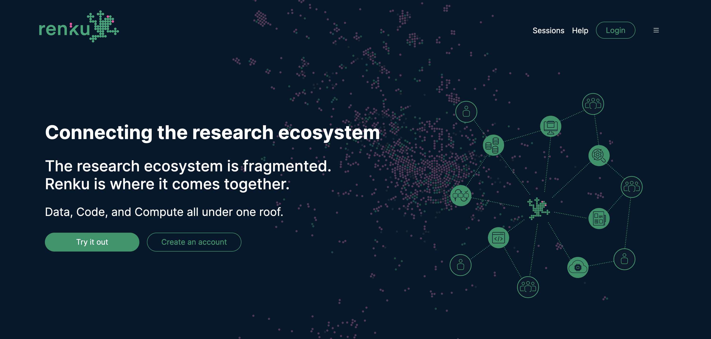

Recreating exactly the result of a data analysis should be easy because, after all, it has been done once before — by a computer! In reality, those of us who work with data often cannot replicate even our own results several months later, much less reproduce work done by others. The reason for this is also clear: repeating an analysis requires keeping careful records of the steps and the exact execution environment.

This record keeping can be tedious if done manually, but, in recent years, a rich ecosystem of freely available tools facilitating reproducibility has flourished. The adoption of these tools has been slow, however, since a particular technical skill set is necessary to use them, and for many scientists and data analysts, the time investment required is simply too large.

At the [Swiss Data Science Center](https://datascience.ch/), we are building a platform called [**Renku**](https://renkulab.io/) that aims to lower the barriers to leveraging this ecosystem. Our vision is to provide a platform where data analysis projects can be discussed, repeated, and verified, and split up into components which can be individually shared, reused, and recombined; we aim to do all this while imposing as small of a disruption as possible to the user’s established way of working. We will try to illuminate the concepts and technology behind Renku and demonstrate its use through a series of articles, starting with this one.

<!-- truncate -->

## Goals

The Renku platform is an open-source software ecosystem enabling reproducible and collaborative data science. Our main design goals are ease-of-use, interoperability, and flexibility. We build on top of industry-standard open-source technologies to achieve these goals. We operate a public deployment of Renku at https://renkulab.io with several thousand users; it is used for scientific collaborations and teaching courses in Switzerland, Europe and the U.S. In addition, we operate a few other smaller deployments for specialized use-cases with access to premium hardware. The Renku platform can be deployed on any suitable infrastructure. For example, the [University of Fribourg](https://www.unifr.ch/home/en/) and the [School of Life Sciences at EPFL](https://www.epfl.ch/schools/sv/) both operate their own instances of the platform.

---

The basic goals of Renku are to:

1. make it easy to record the links between data, code, and computational environments
2. provide tools to utilize the recorded connections for reproducibility, search, and discovery
3. enable interactive communication and exploration of results.

We accomplish these by leveraging existing widely used technologies and dressing them up just enough to lower the barrier to entry for a wide audience.

---

## The knowledge graph is at the heart of Renku

At the heart of Renku is rich, connected, and *meaningful* metadata. Renku builds a knowledge graph out of the metadata contributed by every project, dataset, and workflow using ontologies based on open standards, such as [PROV-O](https://www.w3.org/TR/prov-o/). When a command is run through the Renku command-line interface, information about inputs and outputs is automatically captured and added to the knowledge graph. This lineage enables a number of new possibilities. Users can recompute results using new data or code, rerun analyses with modified parameters or extract automatically-generated pipelines for sharing.

The knowledge graph captures the connections between data, code, people, and concepts and does so within and across projects (indeed, even across instances of the platform!). It is modeled to allow querying for simple questions about data use and provenance (“Who used this data”; “How was this result generated?”), but made to be extensible enough to accommodate domain-specific metadata and queries. These extensions can build on top of the base knowledge graph model to enable deeper community-wide use-cases, and the metadata they contribute can be extracted by clients like web dashboards or bots for automation.

---

The knowledge graph represents the high-level abstraction of the information collected in the platform, but the metadata is not an end in itself — Renku is meant to be a place where people discover, learn, and get things done. Central to the platform are familiar concepts of versioned repositories combined with powerful continuous integration features. These concepts can be alienating to users so we try to make informed choices about sensible defaults in order to allow new users to dive in and start creating and exploring. While Renku simplifies the interfaces to these tools, it does not restrict seasoned users from accessing their full power. Our goal is that Renku is useful for a spectrum of users, from beginner analysts and students to advanced researchers with complex data analysis and management needs.

---

## Sessions provide hosted environments for working

Many users work on the Renku platform directly through hosted interactive sessions. An interactive session built to satisfy the computational requirements can be spawned for each commit of every project so that one can always be sure that results can be worked on, communicated, and understood at a click of a button. Interactive sessions are used by individuals to quickly configure a data-science software stack for their analysis, by groups to efficiently collaborate, and by researchers wanting to share insights with the public. Nevertheless, Renku projects are simply git repositories and can therefore be worked on in a decentralized manner on whatever infrastructure is appropriate for the use-case (for example, a high-performance computing cluster).

---

## Want to know more?

The Renku platform is a versatile ecosystem with many uses and applications. We hope to shed some light on possible use-cases of Renku and stimulate new ideas through this blog. Our team of engineers and data scientists also continuously develop technical solutions to common problems, and we will share insights about what we have learned in that process here as well. We hope you will join us and try Renku out for yourself!

As a starting point, head to our public deployment at https://renkulab.io and try out our [first-steps tutorial](https://renku.readthedocs.io/en/latest/tutorials/01_firststeps.html) to get a sense of what Renku is about. If you have questions or ideas, come join the discussion on our [Discourse forum](https://renku.discourse.group/) or if you want to file an issue you can find our [issue tracker on GitHub](https://github.com/swissDataScienceCenter/renku). Thanks for reading!

---

Thanks to Gavin Lee, Chandrasekhar Ramakrishnan, and Oksana Riba for contributing to this post.
