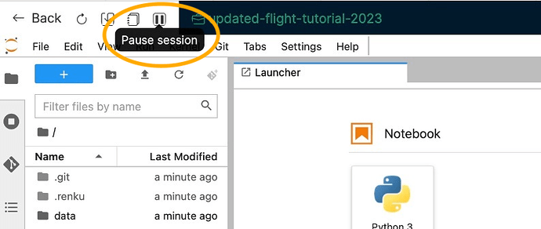
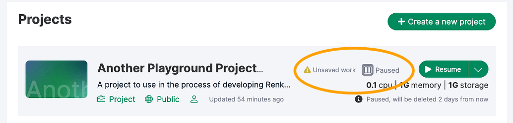

## New: Pause & Resume Sessions

On RenkuLab you can now pause sessions and later resume them exactly where you left off. All of your work in progress, including files, data, and environment changes not saved to git, are resumed right as you left them!

The first thing you’ll notice in RenkuLab is that the session *stop* button has been replaced with a *pause* button.

Paused sessions will be maintained for **15 days**, after which they (and any unsaved work) will be deleted permanently.

You can resume paused sessions from the Dashboard. Not sure if you have any work left un-committed from your last session? The un-saved work indicator on the Dashboard will let you know!

### *A note on auto-saves*

Session pausing replaces RenkuLab's branch-based auto-save mechanism. Most users do not have to do anything to transition from auto-saves to persistent sessions. However, if your last session went into an auto-save, you can still retrieve that work by using Start with Options and selecting your most recent auto-save branch. If your project contains auto-save branches that you do not need anymore, you can safely delete them.
