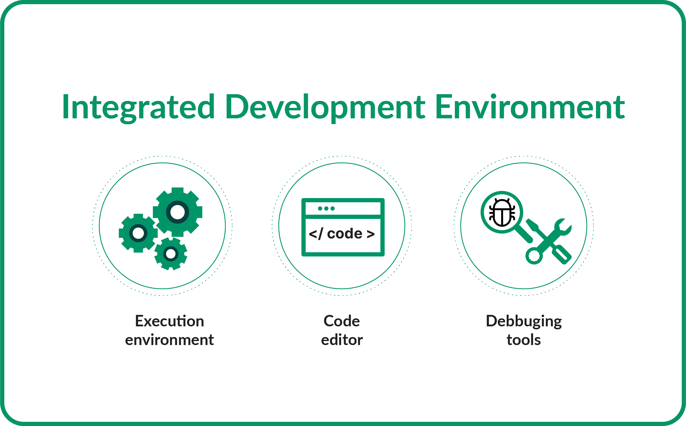

Renku allows you to work either locally with [the Renku CLI](https://renku.readthedocs.io/en/latest/how-to-guides/own_machine/index.html) or directly in the cloud with [RenkuLab](http://renkulab.io/). What if you wish to continue working in your local environment, but do not have adequate compute resources on your machine? An SSH session on RenkuLab can help you there: you can develop code on your computer and run it in the cloud with SSH sessions. One of the motivations to work locally and execute in the cloud is to be able to work from your favorite IDE while accessing additional compute resources. In this post, we discuss:

- Setting up an SSH session on RenkuLab
- Benefits of using an IDE
- A few popular IDEs and how to use them with SSH

<!-- truncate -->

## Setting up an SSH session on RenkuLab

In order to **start an SSH session on RenkuLab** for your project, you need to use the Renku CLI on your computer, check out your RenkuLab project and **open a new session in your local terminal or your IDE, such as VSCode**. Check out the “Connect with SSH” option in the Session Start menu and follow the instructions to get started.

You can find a detailed step by step guide on how to set up a SSH session on RenkuLab in our [docs](https://renku.readthedocs.io/en/stable/how-to-guides/renkulab/ssh-into-sessions.html). _Note that SSH functionality must be enabled by your administrator and may not be available on all RenkuLab deployments._

## What is an IDE? Why should I use it?

If you write code, and do not already use an IDE, you may want to consider it! IDEs are easy to use and include features to make you more productive.

IDE, that is Integrated Development Environment, is a software application which provides functionality to write, compile, and debug code, and typically includes tools that support development efforts.

Using an IDE is quite simple and does not require any special skills except (i) coding skills, (ii) knowledge of development systems, and (iii) a basic familiarity with the IDE platform’s features. Here we describe the basic components of an IDE:

- A code editor: this is the core of a IDE, where you can write your code. Although it may look as a simple text editor, it is much more than just that: it simplifies the process of writing code by adding multiple functionalities, such as autocompletion and language-aware hints.
- An execution environment: it runs the code within the same environment to check if it works. In general, the compilation results open in a separate interface within the same IDE platform, and you can switch between the code editor and the execution environment seamlessly.
- Debugging tools: debugging is the most time consuming task when writing code. IDEs integrate tools to identify programming errors while writing, and allow you to inspect and interact with running programs to understand their behavior.

In addition to the former three components, IDEs can also include other useful features for improving work efficiency. For example, when working with [object-oriented programming (OOP)](https://en.wikipedia.org/wiki/Object-oriented_programming), a class and object browser within the IDE allows the visualisation of the existing hierarchy and inspection of objects and object-oriented classes within the program. Some IDEs provide ready-to-use build automation tools, which help to package and prepare the code for execution.

Using an IDE to develop code saves a large amount of time by tackling and reducing the complexity when writing code. Not only debugging or testing are enlightened, but also other features provided by IDEs make the coding work easier, for example:

- Syntax highlighting: IDEs use different colors or formatting for the code, to make it more readable so you do not get lost in between hundreds of lines of code.
- Refactoring options: automated procedures to ensure an effective renaming of variables, functions or files in the software whole project.

Given that every integrated development environment is a little different, the next section provides more information about existing IDEs and how to use them with remote SSH sessions running on RenkuLab.

## What are the most popular IDEs? How can I use them with an SSH session?

Since their introduction in the late 80s, IDEs have gained a broad acceptance as a unique platform to develop code, compile and debug in a single place. Hence, a large number of IDEs exist nowadays, each with its own flavor. The selection of a IDE depends on the preferences of the users, the requirements of their projects and the features of the IDE. In this post, we will focus on providing a brief description of some of the most popular and widely accepted IDEs and a link on the procedure to enable SSH connection to sessions.

[Visual Studio Code](https://code.visualstudio.com/)

It is a source-code editor made by Microsoft for multiple platforms. In addition to the features highlighted above, such as code completion, code refactoring or debugging, users can also change theme and keyboard shortcuts. It also contains multiple extensions that add functionality. You can learn more about how to establish an SSH connection in Visual Studio Code [here](https://code.visualstudio.com/docs/remote/ssh).

[Spyder](https://www.spyder-ide.org/)

It is an open-source IDE for multiple platforms which aims to support scientific programming in the Python language. Spyder integrates with a wide number of scientific Python packages and other open-source software.

You can learn more about how to establish an SSH connection in Spyder [here](https://mazzine.medium.com/how-to-connect-your-spyder-ide-to-an-external-ipython-kernel-with-ssh-putty-tunnel-e1c679e44154).

[AWS Cloud9 IDE](https://aws.amazon.com/cloud9/)

It is a cloud-based IDE which is packed with a terminal, a debugger and a code editor, and supports many popular programming languages.

You can learn more about how to establish an SSH connection in AWS Cloud 9 [here](https://docs.aws.amazon.com/cloud9/latest/user-guide/create-environment-ssh.html).

[PyCharm](https://www.jetbrains.com/pycharm/)

PyCharm stands for an IDE with code analysis, a graphical debugger, an integrated unit tester, integrated support for version control systems, and support for data science with Anaconda.

Running SSH terminal in PyCharm is only available for the PyCharm Professional Edition. You can learn more about how to establish the SSH connection in PyCharm [here](https://www.jetbrains.com/help/pycharm/running-ssh-terminal.html).

## Conclusion

This post discusses the convenience of working in RenkuLab through SSH access to your sessions and provides a guide for starting an SSH session. Thus, this post familiarises the readers with integrated development environments (IDEs). Do not doubt to contact us in [General](https://renku.discourse.group/c/general/1) in case you have any comment or suggestion! You can also watch our [video](https://youtu.be/mVxTmPi8aBg) on SSH into sessions for further insights.
