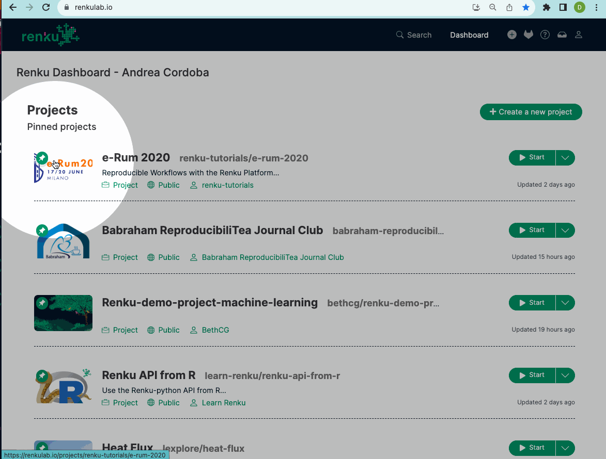

## Pin your favorite projects to the Dashboard

Never lose track of important projects again! Pin a project by clicking the new pin icon in the top left corner of the project image. You can pin up to 5 projects, and these will stay at the top of the dashboard, above your recently viewed projects. 

## New Renku Landing Page

We are proud to release our completely redesigned landing page! Our new 
page better describes Renku and its capabilities, and features multiple entry points for getting started with the platform. 

