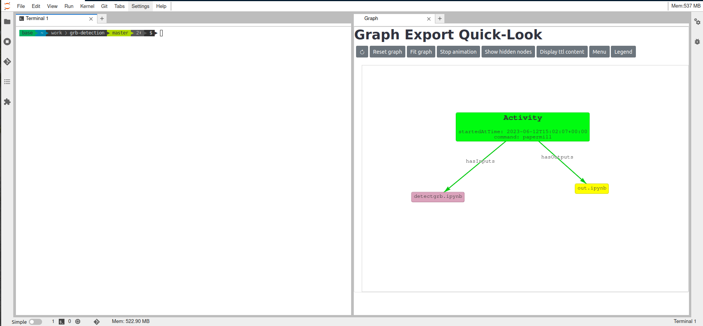

## Support the workflow development via renku plugin

To support the development of workflows in Renku, a set of dedicated functionalities, provided as Renku plugins, are made available. Specifically, these plugins are:

* `renku-graph-vis`: to offer a visualization of the project's Knowledge Graph.
* `renku-aqs-annotation`: to Intercept calls to astroquery functions and store them in the project's Knowledge Graph.

### `renku-graph-vis`

This plugin provides a graphical representation of the renku project's knowledge graph in two ways:

* From within the renkulab session
* Via a set of CLI commands. 
 
In this way, the ability to have a live overview of the ongoing development for real-time monitoring is introduced.
The image below shows an example of the graph during a Renkulab session, with information about the execution of a notebook (`papermill` command).

To initiate or access the live graph visualization during your session, simply click on the Graph icon located on the main page, as shown in the image below.

As mentioned above, a set of CLI commands are also offered, in particular these are:

* `display`: to generate a representation of the graph over an output image.
* `show-graph`: to start an interactive visualization of the graph over the browser.

More technical details are presented in the README of the repo page: https://github.com/oda-hub/renku-graph-vis/

### `renku-aqs-annotation`

This plugin enables the tracking of the accesses to astronomical archives and services in the project Knowledge Graph.
In particular, the plugin intercepts several key [`astroquery`](https://astroquery.readthedocs.io/en/latest/index.html) methods and stores annotations containing information about the calls to these methods (like the arguments used in the call itself) to the project's Knowledge Graph.

In the image below, the graph produced by the `renku-graph-vis` plugin during a renkulab session, exposes the information added to the project Knowledge Graph as a result of the interception of the `astroquery` methods. Specifically, it can be seen that during a `papermill` run of the `test-notebook.ipynb` notebook (that produced `out.ipynb` as an output notebook) a call to the `astroquery` method `query_object`, using the `SimbadClass`, has been detected. This notebook is requesting the object `Mrk 421` object. The highlighted labels on the edges provide information about the relationship between the two nodes: during the `papermill`execution, a call to the `query_object` method is executed (call label) and in turn, this requests the Astrophysical Object `Mrk 421`.

More technical details can be found in the `README` of the repo page: https://github.com/oda-hub/renku-aqs-annotation