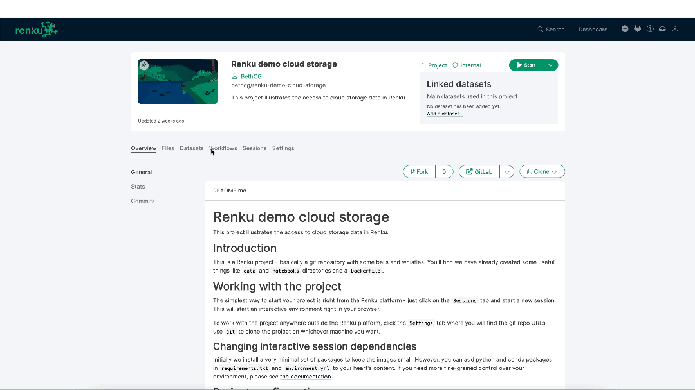

Working with your data in Renku is faster and simpler: you can write and read your data from your external storage services, such as S3, Azure Blob or WebDAV among others.

RenkuLab interactive sessions can access data hosted in a cloud storage system, and the storage is simply mounted as another folder in your session. You can concentrate on developing your code to analyse your data, rather than worrying about moving data around! Plus, when you add a cloud storage to your project, that configuration is available to all project members, so you can share the results with your colleagues or even with the broader community. Who has access is still completely in your control: the access to cloud storage is controlled by the storage provider, not Renku.

To add cloud storage to your Renku project, go to your project's Settings and find the new Cloud Storage tab.
Check out Renku (documentation)[https://renku.readthedocs.io/en/latest/how-to-guides/renkulab/external-storage.html] for more details on how to configure cloud storage for your project.

If you use [SSH sessions via the CLI](https://blog.renkulab.io/ssh-sessions), you can use cloud storage there too. You just need to configure cloud storage for your project on RenkuLab.io, and those storages will be mounted in your remote session.
