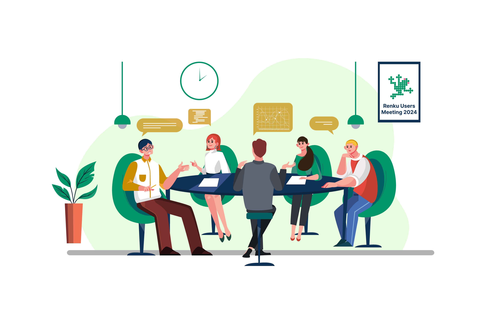

Join us in Bern to meet other Renku users and learn how they leverage Renku for data science, research, and teaching. We will share updates about the upcoming new version of Renku, [Renku 2.0](https://blog.renkulab.io/renku-2/), and the features prioritised for the second half of 2024. In addition, we will discuss the open [Call for Collaborative Projects](https://www.datascience.ch/call-for-projects/ordes) and describe how you can get involved. You are also invited to voice your challenges in an open discussion about collaborative open research, and to bring your suggestions for new Renku features.

**When**: June 27th from 13:00 CET until 17:00 CET

**Where**: [University of Bern](https://maps.app.goo.gl/iU54HQhM8ZxHQt4R7) and Zoom

[**Register here!**](https://docs.google.com/forms/d/e/1FAIpQLSfI-dYL09s_A2RQkNikHT7-mSB63KgMQ_T5lm6k9lAtL1mS9A/viewform?usp=pp_url)

## Agenda

- 13:00-13:15 Welcome and Introduction
- 13:15-14:00 Renku 2.0 Update: Milestones, Demo & Roadmap, [Call for collaborative projects](https://www.datascience.ch/call-for-projects/ordes)
- 14:00-14:15 Break
- 14:15-15:15 Renku in the Wild: User Presentations from Research & Teaching

  - **Reproducible Data Acquisition and Processing in X-ray Imaging Research** 
    Michał Rawlik, _Scientist at the Institute for Biomedical Engineering at ETH Zürich_

  - **How Renku can help us to detect natural hazards: A case study from environmental seismology** 
    Patrick Paitz, _Postdoc at Swiss Federal Institute for Forest, Snow and Landscape Research (WSL)_

  - **Teaching with Renku: A Co-Evolution** 
    Noe Leon Thalheim, _Tech Lead, "Grundkurs Programmieren" at Berner Fachhochschule (BFH)_

  - **Renku in astronomy** 
    Volodymyr Savchenko, _Senior Data Scientist & Lecturer at École Polytechnique Fédérale de Lausanne (EPFL)_

- 15:15-15:30 Break
- 15:30-16:30 Open Discussion: Challenges in Collaborative Open Research projects
- 16:30-17:00 Networking and Refreshments
