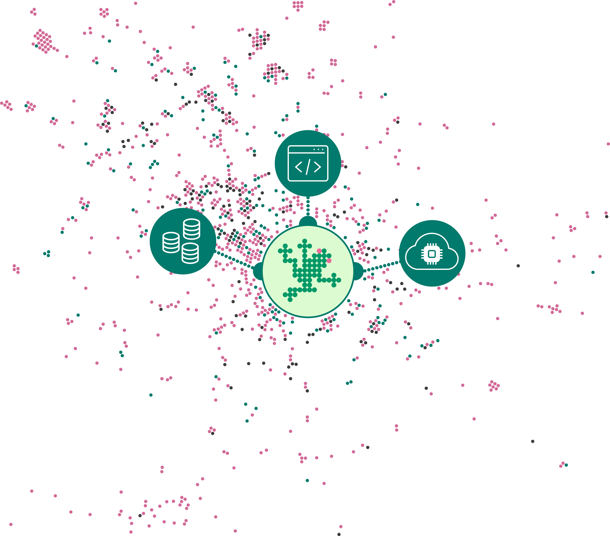

Renku has evolved considerably over the past several years; from our strong
initial focus on computational reproducibility to our current goals of building
connections within and across communities. As we engaged with various research
communities, we understood that one of the main struggles researchers face in
collaborative projects is consolidating a scattered collection of resources
across various providers, tools, and technologies.

<!-- truncate -->

We have therefore decided to refocus our efforts and (re)build the platform to
try and address this gap in the ecosystem. We envision Renku as a platform that
connects and enables data-centric projects from the ideation phase, through the
productive, results-oriented phase, all the way to dissemination and
publication. In the process, members of a project can bring together their data
sources, repositories and computational environments. A project’s assets can be
used and reused in other projects; they can be kept private, shared with team
members or with the more general public. In this way, we hope to create a
vibrant ecosystem of data and tools used to process, interpret, and understand
it.

We are calling this new iteration “Renku 2.0” even though Renku version 1.0 does
not currently exist! We want to imprint the idea that this is a new concept, not
just an evolution of the current one.

## Mix and match: code, data and compute

To offer users flexibility, Renku 2.0 is based on modular project
configurations. Users can bootstrap their projects with a mix of code
repositories, data sources, and compute environments and evolve
them as the project matures. For example, in an early stage of a project, a data
scientist may simply require a quick way to connect a cloud compute environment
to a data source for some basic data exploration; as the analysis of the data
deepens, they may need to add a code repository to start versioning the code and
collaborate with others in a more structured way. Later on, someone else on the
project might build a containerized app or dashboard to demonstrate the data
properties and model results more easily with non-experts.

Renku 2.0 allows you to select the components that you need for your project
to work. Beyond the current capabilities that Renku already offers, you can
leverage the flexibility of Renku 2.0 in multiple new situations, for example:

- If you are testing out RenkuLab... and you want to bring your **existing code repository** into a project.
- If you are starting a new project... and you want to **start out with a basic compute environment**. Later, you will decide what data and code sources you need.
- If you find an interesting dataset... and you want to **test it out in a live compute environment** so you can decide quickly if you want to move forward with it.
- If you are working on a project that uses **multiple repositories** from multiple collaborators... and you want to use all of them in 1 Renku project together.
- If you need to showcase your project... and you want to create a **dedicated dashboard** for the public to view.

To enable these use-cases, Renku projects require a few ingredients: **data**, **code**,
**containerized environments**, and **flexible compute** resources.

### Data

Data science projects need data! Users can connect different types of [cloud
data sources](../cloud-storage) to their projects, such as S3 buckets and WebDAV
resources. Projects may also bring published data into the platform where it can
be staged on fast storage for more efficient processing. Data sources can be
shared among individuals, groups or communities to simplify reuse. The access to
external data sources is controlled by the 3rd party cloud storage provider.

### Code

In Renku 2.0, users can bring code repositories into their project not only from
the connected Renku-managed GitLab instance, but also from external GitLab
instances and GitHub! We encourage everyone to version their code, but if
the project does not require versioning (yet), you are not obligated to use it.
You can start a Renku project with no code repository at all!

### Containerized Compute Environments

Renku 2.0 continues to offer the possibility of working in the cloud, where all
project resources are available for all collaborators. For quick, uncomplicated
data explorations, users can start working immediately from pre-configured
images, loaded with some standard libraries depending on the desired programming
language. In addition, users can define their own environments to
use in compute sessions; these can be annotated and shared so members of a
community can benefit from each other’s efforts and use a consistent software
stack. Furthermore, we plan to allow users to connect their Renku projects to
external compute resources (e.g. HPC or other cloud compute).

## Sharing and collaborating

In addition to connecting all the required resources under one roof, Renku will
make these elements **searchable**, encourage their **reuse** between
projects, and illuminate **connections** between them (even across projects)
wherever needed. This will be accomplished by extracting and indexing useful
metadata about all of the project's components and making this information easily
accessible through a platform-wide search.

## UX Research

As we develop this new iteration of Renku, we rely on great feedback from our users
to make sure that we stay on the right track. If you are interested in having a say
how the project develops and contribute your thoughts to features that are in the pipeline,
please [drop us an email](mailto:hello@renku.io)!

## Further information

Are you interested in learning more about Renku 2.0? If so, have a look at the following resources:

- Watch our [Renku 2.0 webinar](https://youtu.be/6J0INjPFQd4) or view the [slides](https://drive.google.com/file/d/1empUHHTonffW1fhdB_3DCIH-yVUz3MU8/view?usp=share_link)
- Check out the [Renku roadmap](https://github.com/SwissDataScienceCenter/renku-design-docs/blob/main/roadmap.md)
- Give feedback on our [design docs](https://github.com/SwissDataScienceCenter/renku-design-docs/tree/main)

If you want to test Renku 2.0 beta or participate in UX research [contact us!](mailto:hello@renku.io) - we look forward to hearing from you!
