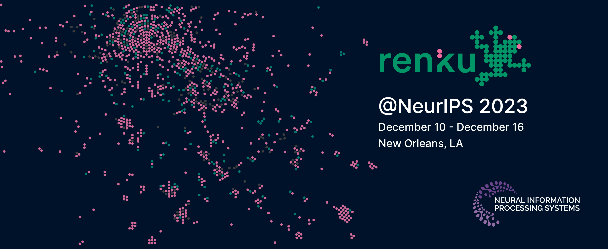

<!-- truncate -->

The Swiss Data Science Center presented Renku in the [37th Conference
on Neural Information Processing Systems (NeurIPS)](https://neurips.cc/Conferences/2023),
which took place on Dec. 10th to 16th 2023 in New Orleans (US).
Our contribution [“Renku: a platform for sustainable data science”](https://papers.neurips.cc/paper_files/paper/2023/file/838694e9ab6b0a193b84daaafcac0eed-Paper-Datasets_and_Benchmarks.pdf) presents
those Renku features that make it a unique platform to support sustainable
development and use of data and code, and showcases how Renku works in
different scientific domains.

Check out our [paper](https://papers.neurips.cc/paper_files/paper/2023/file/838694e9ab6b0a193b84daaafcac0eed-Paper-Datasets_and_Benchmarks.pdf),
[complementary materials](https://proceedings.neurips.cc/paper_files/paper/2023/file/838694e9ab6b0a193b84daaafcac0eed-Supplemental-Datasets_and_Benchmarks.pdf),
and [poster and presentation](https://neurips.cc/virtual/2023/poster/73464).

In case you would like to cite Renku in your work, please use this citation:

```
@inproceedings{NEURIPS2023_838694e9,
 author = {Ro\v{s}kar, Rok and Ramakrishnan, Chandrasekhar and Volpi, Michele and Perez-Cruz, Fernando and Gasser, Lilian and Ozdemir, Firat and Paitz, Patrick and Alisafaee, Mohammad and Fischer, Philipp and Grubenmann, Ralf and Harris, Eliza and Olevski, Tasko and Remlinger, Carl and Salamanca, Luis and Capon Garcia, Elisabet and Cavazzi, Lorenzo and Chrobasik, Jakub and Cordoba Osnas, Darlin and Degano, Alessandro and Dupre, Jimena and Johnson, Wesley and Kettner, Eike and Kinkead, Laura and Murphy, Sean D. and Thiebaut, Flora and Verscheure, Olivier},
 booktitle = {Advances in Neural Information Processing Systems},
 editor = {A. Oh and T. Naumann and A. Globerson and K. Saenko and M. Hardt and S. Levine},
 pages = {42161--42173},
 publisher = {Curran Associates, Inc.},
 title = {Renku: a platform for sustainable data science},
 url = {https://proceedings.neurips.cc/paper_files/paper/2023/file/838694e9ab6b0a193b84daaafcac0eed-Paper-Datasets_and_Benchmarks.pdf},
 volume = {36},
 year = {2023}
}
```
