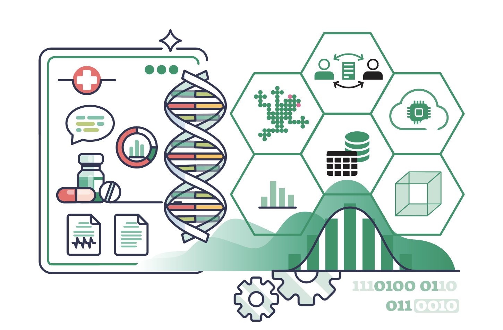

<!-- truncate -->

[Nexus](https://www.nexus.ethz.ch) and Swiss Data Science Center organized the
workshop "Empowering FAIR data and reproducible research" within the
[Personalized Health Technologies 2024 event](https://personalizedhealth.ch/#overview).
Participants could learn about the Gatekeeper project, where Renku is leveraged
for empowering researchers to build collaborative communities within the biomedical
domain by bringing together data, code and compute.

Open research leads not only to better collaboration and reuse, but also better
efficiency for the individual researcher. A research project represents a complex
orchestration of data, code, and compute resources: Where is this data located?
Which code generated it? And where can it run? Bringing together these resources
not only poses an administrative burden for the researcher, but also often blocks
collaboration and makes it harder to trace and reproduce the research process.
There is a need for technology to help researchers work in a rigorous, transparent,
and reproducible (RTR) fashion and achieve FAIR data management (ensuring that all
data is Findable, Accessible, Interoperable, and Reusable).

The Gatekeeper project aims to address this need within the Biomedical domain by
leveraging the open-source Renku platform, which connects the ecosystem of data, code,
and compute to empower researchers to build collaborative communities.

In this workshop, the participants learned about some of the tools and techniques
important for FAIR data management and RTR research, and learned how to seamlessly
integrate their own research data and code into the Renku platform. Thus, participants
provided valuable feedback about new requirements and necessary extensions.
