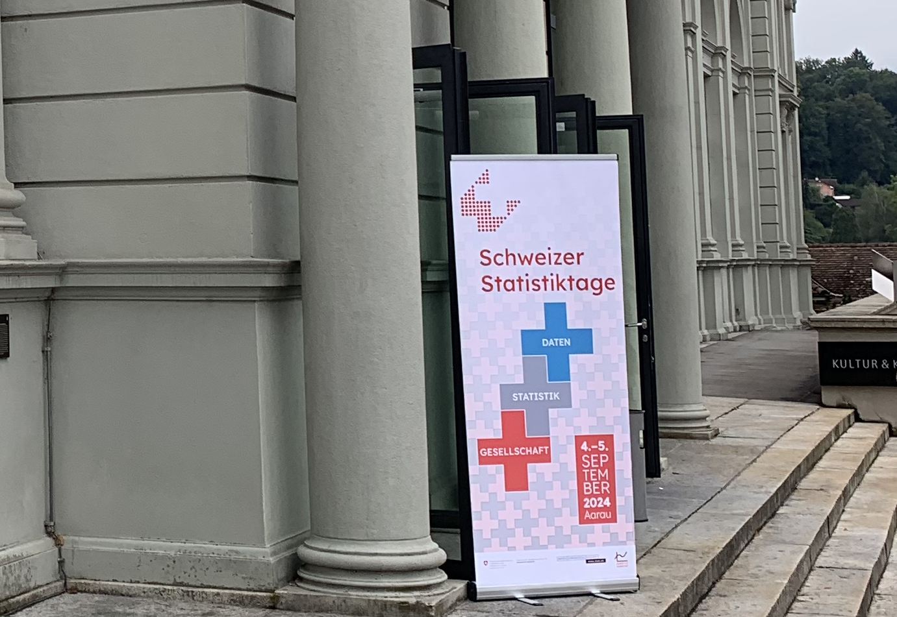

<!-- truncate -->

The [Swiss Statistics Meeting](https://stat.ch/en/swiss_statistics_meeting) took place
on Sept. 4th and 5th 2024 in Aarau (Switzerland). It gathered specialists related to
the statistics domain across private and public sectors. Multiple presentations contributed
to discuss developments in research and methodological questions related to data across
the data lifecycle, including topics such as data sources,
data collection and management, data analysis, open data, and data security among others.

Our contribution [“Renku: a platform for transparent and reproducible data-centric work”](https://drive.google.com/file/d/1qYsrPm4rm3Osjmjvmoz0RIgWyxWN335F/view?usp=share_link)
focused on those Renku features in Renku 2.0 that make it a unique platform to support
transparent data-centric work. Renku connects to public and private data sources, and to
code repositories. Thus, Renku 2.0 can launch different types of sessions on top of them,
where data scientists, statisticians and other practitioners can work in their prefererred
compute environment (Python, RStudio, Matlab, VSCode or others ) with the compute infrastructure
that they select. Having these three components under the same umbrella makes it easier to
share data-related work within the same team and with the broader community.

Check out the conference [book of abstracts](https://portal-cdn.scnat.ch/asset/60cc5dbd-13e2-53a0-ab5b-d8ba9110c661/Book_of_Abstract%202024_v5.pdf?b=7e802f5d-0c36-585d-9da6-946c253778f8&v=29652b64-c1dd-5bea-bf07-13e6be5fc292_0&s=LgOJou7xqSX7gljgrR5fBZqhBZtQKxMerJzYdDOq2kWX3c64qcNH-YRd5Fv1jY0Lu1OEmh5n2pYG1nVkMg0RsRzHaoEcYrtKvtItNNOwYcyl0oby2aq4OGuHmzmTC_on2D4qWefxMZY7x5jBUlasvEaebv5GUe8fYjfOpogW7AU).
