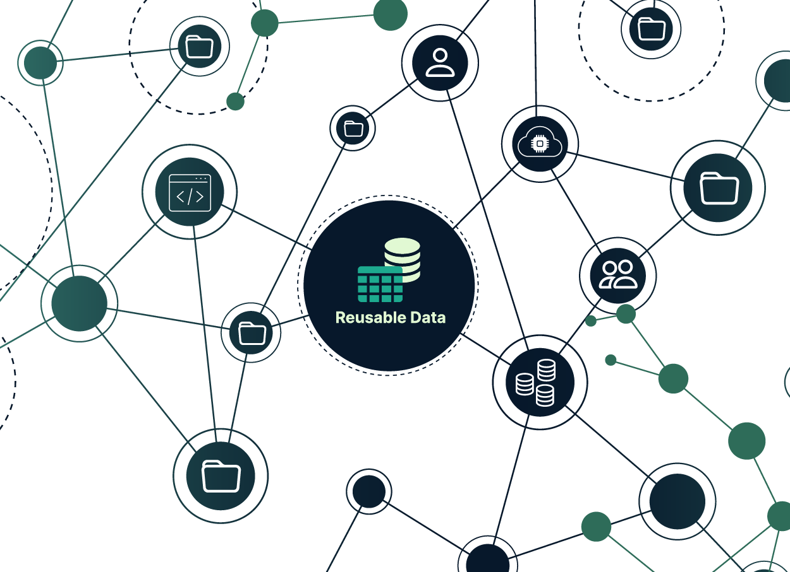
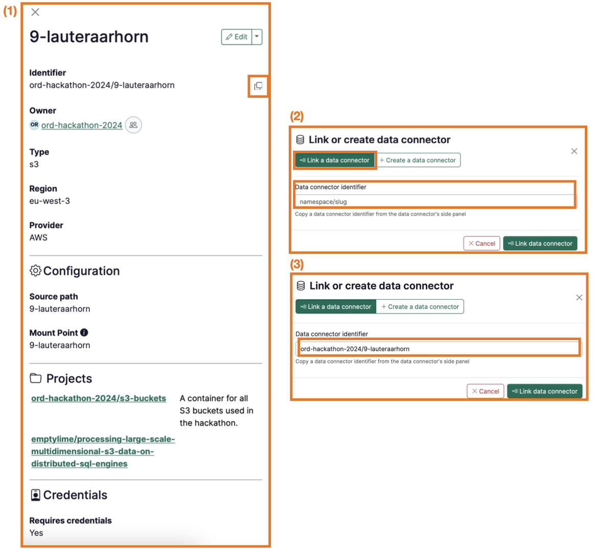

We’ve been busy behind the scenes, and now it’s time to share some of the exciting updates we’ve rolled out over our last few releases. These features are part of the Renku 2.0 beta, designed to to empower collaboration and make it easier to connect and share data, code, and compute resources. Here’s a quick tour of what’s new.

{/* truncate */}

### **Reuse Data Connectors Across Projects**

Sharing is caring, and now Renku makes it easier than ever to share and reuse data connectors (formerly called data sources) across projects. Instead of re-entering connection details every time, you can now reuse existing data connectors from your group or even other shared projects!

📌 _How it works_: Copy the identifier of an existing data connector (1) and link it to your project with just a few clicks (2,3).

🔗 _Check out the How To guide_: [How to link a data connector to your project](https://renku.notion.site/Quick-Start-tutorial-1460df2efafc80998204c1f61e333e63?p=1220df2efafc8021a4e7e6012d3a18aa&pm=s)

This feature saves time, reduces duplication, and encourages collaboration. We can’t wait to see how you’ll use it!

---

### **Expanded Support to “Bring Your Own Image” to RenkuLab**

Calling all power users: You now have more flexibility when running custom images in RenkuLab sessions! Previously, your image needed to include JupyterServer. That’s no longer the case! Now, you can bring almost any Docker image that fits your needs.

🔗 Check out the How To guide: [How to use your own docker image for a session launcher](https://renku.notion.site/How-to-use-your-own-docker-image-for-a-session-launcher-11f0df2efafc80af848ffcaf9ccff31c)

This change won’t affect most users right now, but it’s part of a broader vision to make customizing session environments easier for everyone. We’re working on even more exciting updates to support your workflows—stay tuned!

---

### **Bug Fix: GitHub Connection Issue**

We’ve resolved a pesky issue that was causing trouble for some users when connecting their GitHub accounts. Thanks for your patience while we tracked this one down!

---

💡 **Want to explore all the details?** Check out the [full release notes](https://github.com/SwissDataScienceCenter/renku/releases).

---

### **Join the Renku 2.0 Beta!**

All these updates are part of the Renku 2.0 beta, designed to empower collaborative research and support open data sharing. We’re actively inviting new beta testers to join us. Interested? [Get in touch](https://www.notion.so/dd098db288ff433893a4d4d429da99c1?pvs=21)—we’d love to hear from you!

As always, thank you for being part of the Renku community. Your feedback and input help us shape a platform that supports open, collaborative research. Don’t hesitate to [reach out](https://renku.notion.site/Contact-dd098db288ff433893a4d4d429da99c1?pvs=74)!

Happy Renku-ing! 🐸
