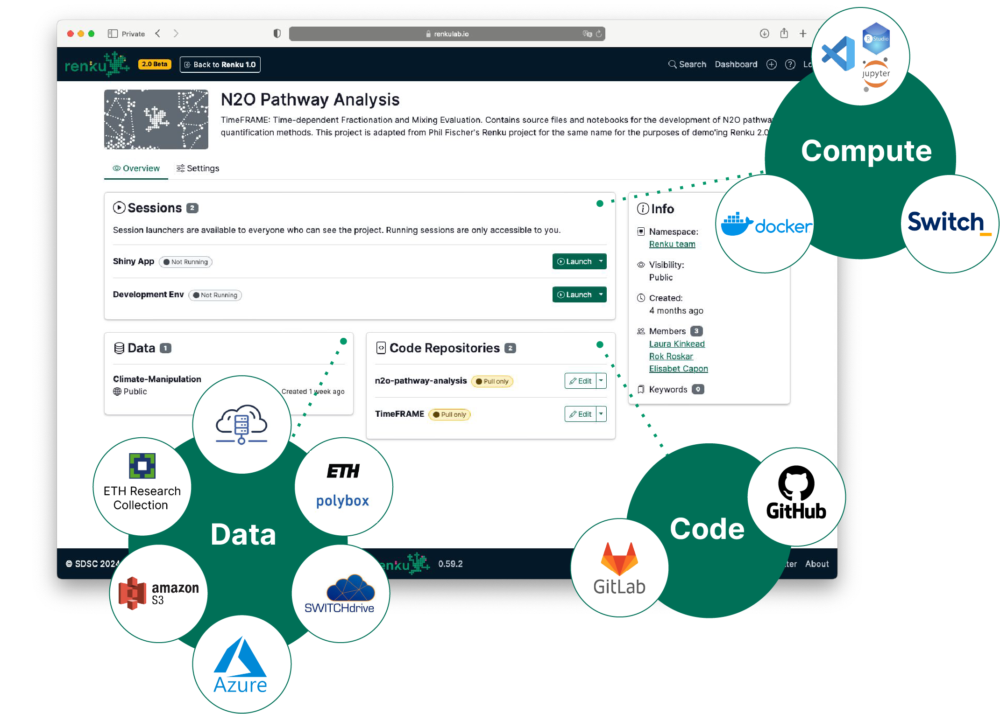
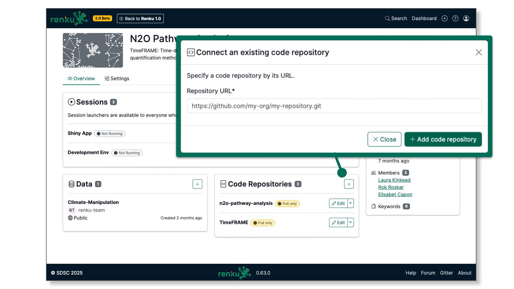
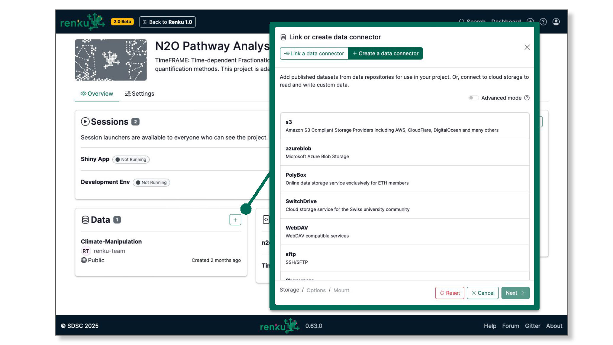
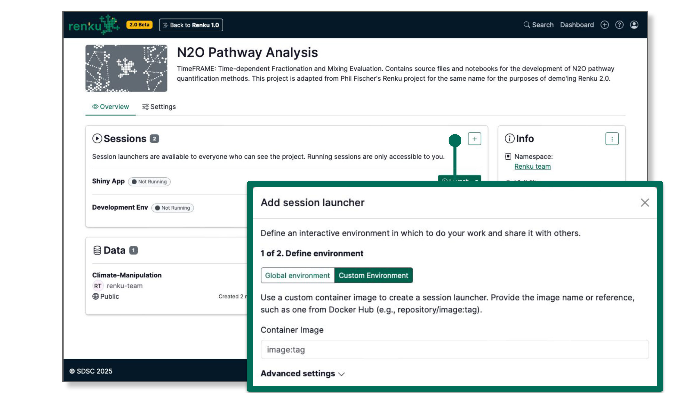
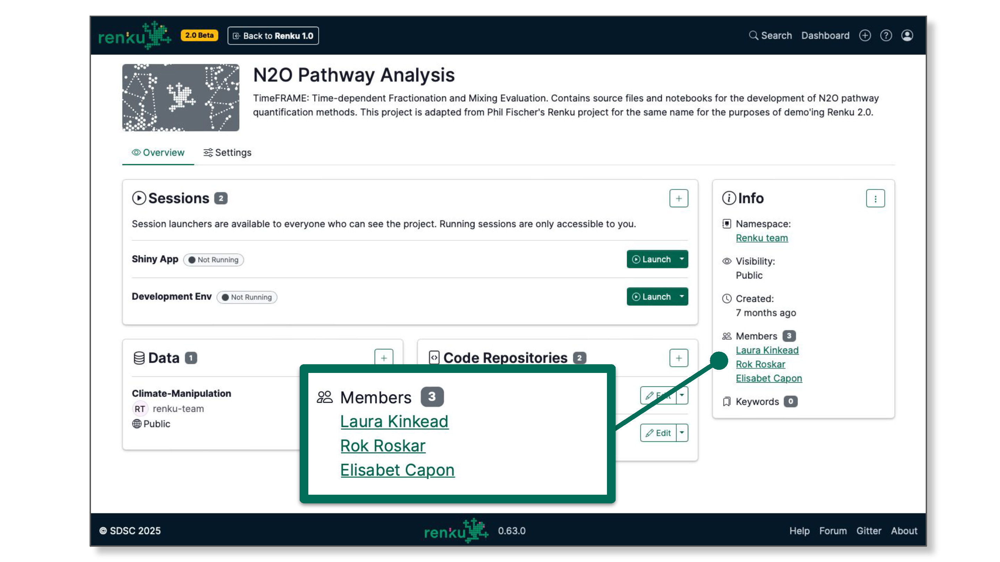
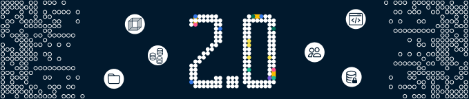

Are you a seasoned Renku user who is curious to know the key differences between Renku 1.0 and 2.0?
Here's a summary of what's new.

<!-- truncate -->

### Connect external Code Repositories

You can now connect one or more Git repositories (or none!) to a Renku project.

Unlike in Renku 1.0, a Renku 2.0 project is not a Git repository itself. And when you connect a
repository, Renku does not modify the code repository in any way. Your code stays as it is, and
Renku stays out of the way.

:::tip

[See how to connect a code repository to your Renku
project](https://www.notion.so/Code-repository-2bbc38797efe4ed1b5f6be16fd95b82e?pvs=21)

:::

### Data Connectors replace Datasets

There's no need to move your data into Renku - keep it where it's stored and simply link it to your
project.

Access rights remain fully controlled by the system where your data lives. Renku does not alter
permissions, so private data stays private.

While data versioning isn't a feature in Renku 2.0, you can trace how a data connector is used
across projects. Open a data connector's side sheet to see all linked projects.

:::tip

[Learn more about data
connectors](https://www.notion.so/Data-connector-3ae1e46fdb094cc48516a104457e5633?pvs=21)

:::

### Do more with Sessions

Bring a wider range of images to Renku 2.0 without the requirement for Jupyter. This makes the
platform more versatile and adaptable to your needs.

:::tip

[Learn more about Renku 2.0
Environments](https://www.notion.so/Environment-338f0b4e5fe04437a36dfa620a126304?pvs=21)

:::

### Enhanced Sharing

It's much easier to share your project in Renku 2.0. Add collaborators directly to your project, and
create groups to organize collections of projects and data connectors.

:::tip

[Learn more about
sharing](https://www.notion.so/How-to-add-people-to-a-project-9026ada14bd7446cbd6a0a638a7eb5d1?pvs=21)
and [groups](https://www.notion.so/How-to-create-a-group-d704bacc38b644c19470a223b2b320cb?pvs=21)

:::

### A new vision for Workflows

Instead of building our own workflow tool, Renku 2.0 embraces existing workflow tools. This allows
you to use the tools you're already familiar with and integrate them seamlessly into your projects.

## Start Exploring Today!

Take [Renku 2.0](https://renkulab.io) for a spin and discover how easy collaborative research can
be. We can't wait to see what you'll build with Renku 2.0!
