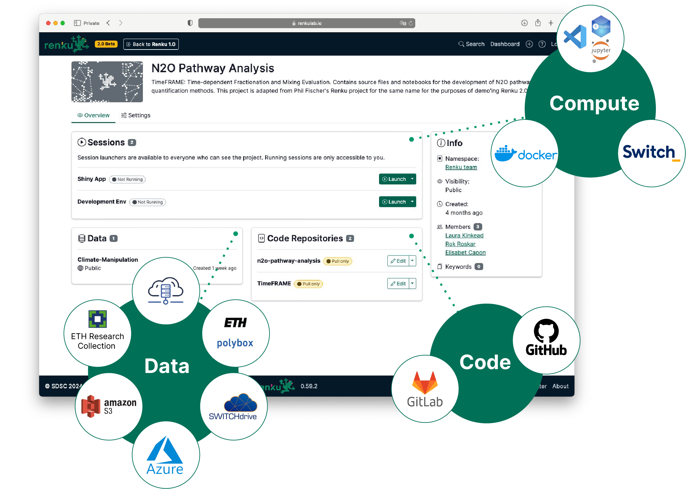
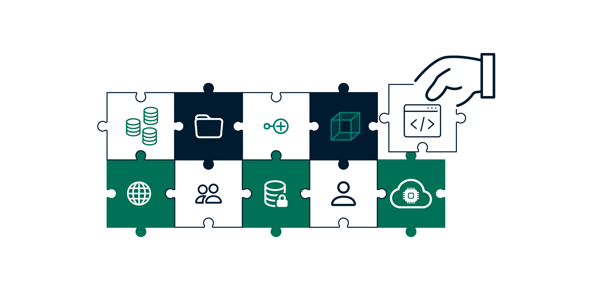

The wait is over! After a year of dedicated work and six months of testing in beta, Renku 2.0 is now
open for Early Access. This means our entire user community is invited to explore the new and
improved version of our open-source collaborative computing platform. Whether you're a seasoned
Renku user or new to the platform, Renku 2.0 offers exciting possibilities for your research and
teaching.

<!-- truncate -->

### Why Renku 2.0?

Renku's mission has always been to support researchers by enabling collaboration, data
accessibility, and reusability. With Renku 2.0, we're taking this mission to the next level by
making it easier than ever to connect data, code, and compute resources into a seamless research
workflow.

In Renku 2.0, you can:

- **Connect your favorite tools and platforms.** Hook up your Renku project to GitHub repositories,
  external data sources, and more. Flexible integrations make collaboration easy and powerful.
- **Create 'Plug and Play' projects.** Mix and match code, data, and compute as needed to suit your
  project. You can link and reuse resources across multiple projects, too! The platform adapts to
  you, not the other way around.

:::tip

Want to learn more? Check out our [Deep Dive: What's New in Renku 2.0](../deep-dive-2-0).

:::

### What's Coming Next?

We're working hard to bring you even more features as we prepare for the full **launch of Renku 2.0
in spring 2025**.

One of the key enhancements on the horizon is the ability to **customize your compute environment**.
In addition, we'll be making it easier to **migrate projects** into Renku 2.0.

Beyond that, we're planning integrations with data repositories, support for documentation and
metadata, and connections to external compute systems.

### Ready to Try Renku 2.0?

Getting started is easy! [Log in to Renku](https://renkulab.io), and you'll see a banner announcing
Renku 2.0 Early Access. Click the “Try it out” button to explore the new platform.

Not ready to commit? No problem. You can switch back to Renku 1.0 anytime by using the button in the
top navigation bar. You are free to experiment at your own pace without disrupting your existing
workflows.

Stay tuned for updates, and don't hesitate to share your feedback as you explore Renku 2.0. We'd
love to hear from you— [reach
out](https://renku.notion.site/Contact-dd098db288ff433893a4d4d429da99c1?pvs=74) with your feedback,
questions, or ideas! Your insights are invaluable as we refine the platform. We can't wait to see
what you'll build with Renku 2.0!
