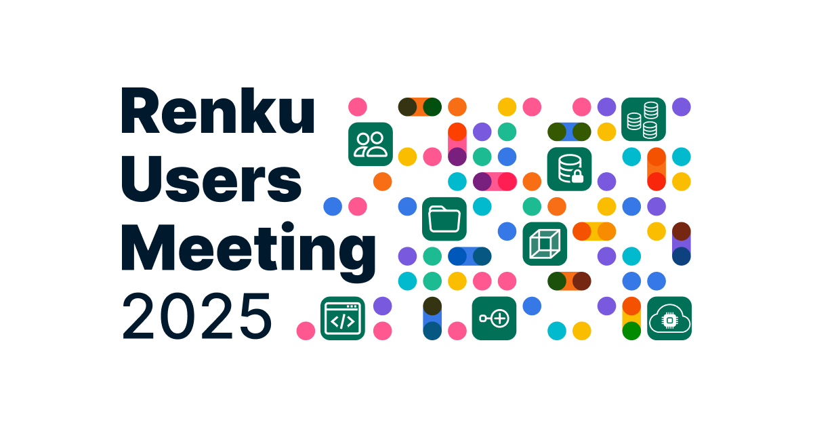

Join the 3rd Renku Users Meeting to learn more about Renku 2.0 and how others leverage Renku for research and teaching. We will also share the features prioritised for the second half of 2025. We are happy to host a open forum, where you can voice your opinion and challenges regarding collaborative open research and teaching.

**When**: June 23rd from 13:00 CET until 16:30 CET

**Where**: [ETH Rat Bern, Room H403, 4th Floor](https://maps.app.goo.gl/sMBQPSbnctSweYmq8) and Zoom

[**Register here to get your link to the event.**](https://renku.notion.site/8af343760ff44adba63be982480c7a59)

## Agenda

- 13:00-13:15 Welcome and Introduction
- 13:15-14:00 Renku 2.0
- 14:00-14:15 Break
- 14:15-16:30 Renku Lightening Talks: Presentations with Challenges and Solutions in Teaching and Collaborative Open Research projects
- 16:30-17:00 Networking and Refreshments