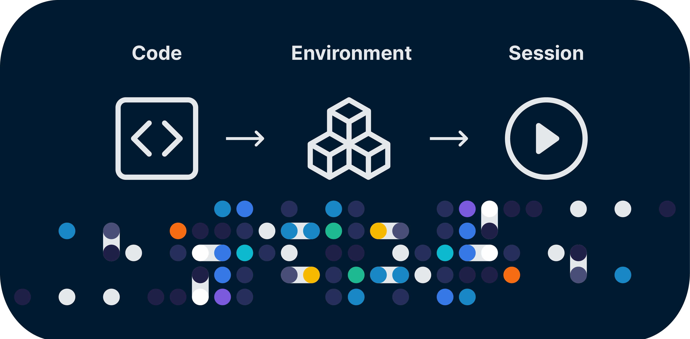
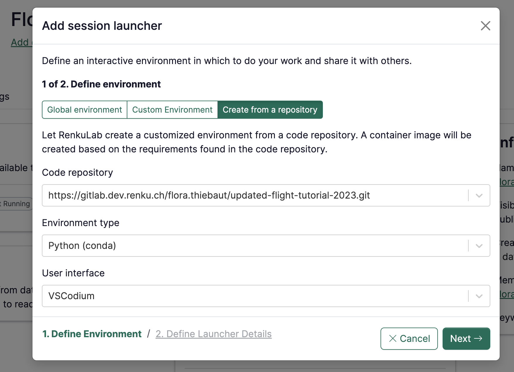
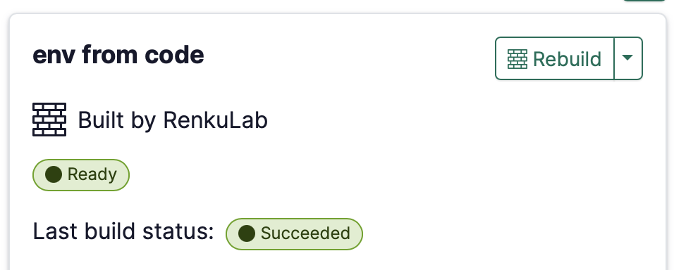

Need a specific set of packages in your Renku session? Now you can customize exactly what's
installed in your session with Renku-built environments. Simply connect a code repository containing
a file with your project dependencies (e.g. an `environment.yml`), and let Renku build your session
environment (aka docker image) for you!

<!-- truncate -->

To create a session with custom packages, create a new session launcher and select 'Create from a
repository'. Select the code repository that contains a environment definition file, and you're
done! Renku will take care of building the underlying docker image.

When you create a session launcher this way, your environment will start building right away. You
can view the status of the environment build in the session side panel.

Once the environment is ready, launch your session, and all of the packages that were listed in your
environment definition file will be available in your session!

At the moment, this functionality supports creating python environments, and we will be adding more
modes soon! Check out our
[roadmap](https://renku.notion.site/Roadmap-b1342b798b0141399dc39cb12afc60c9) to learn more.

:::tip

To learn more about creating code-based environments, including what environment definition formats
are supported, see [our
documentation](https://renku.notion.site/How-to-create-a-custom-environment-from-a-code-repository-1960df2efafc801b88f6da59a0aa8234?pvs=21).

:::

We would love to hear your feedback on this new feature! Let us know by writing us on our
[forum](https://renku.discourse.group/).
