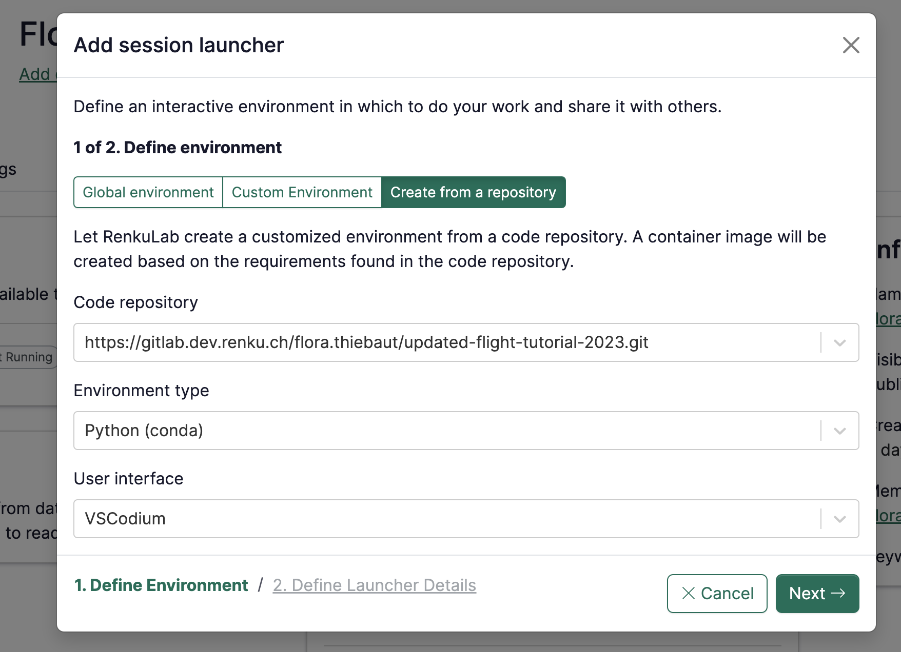
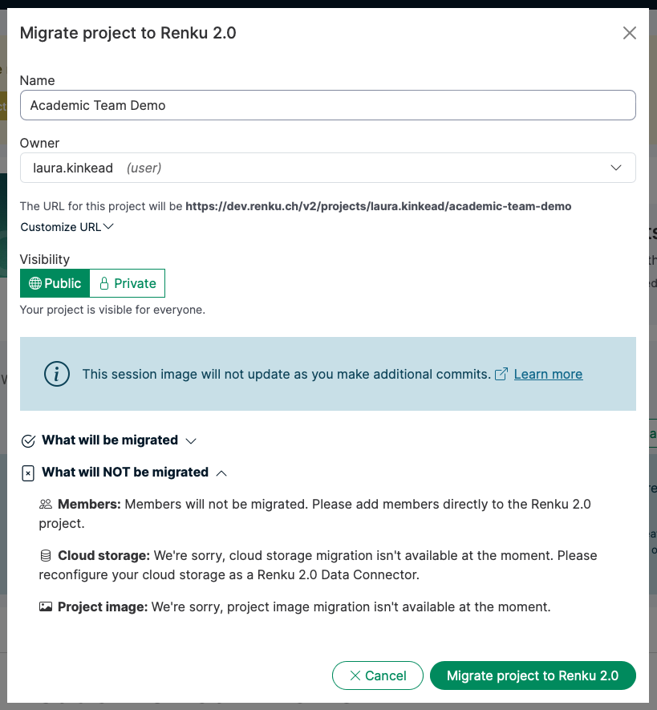

This month has been jam packed with new Renku features! Here are the highlights of the ones we're
most excited about to help you collaborate in research and teaching.

<!-- truncate -->

## 🧑‍💻 Create a custom Renku session environment from code

Need a specific set of packages in your Renku session? Now you can customize exactly what's
installed in your session with Renku-built environments. Simply connect a code repository containing
a file with your project dependencies (e.g. an `environment.yml`), and let Renku build your session
environment (aka docker image) for you!

We're so excited about this feature we gave it a whole blog post of its own. Read more
[here](../2025-03-28-built-envs/index.mdx) or jump straight to the [
documentation](https://renku.notion.site/How-to-create-a-custom-environment-from-a-code-repository-1960df2efafc801b88f6da59a0aa8234?pvs=21)!

## 📄 Add documentation to your Renku project

Make your Renku projects your own with descriptions, links, images, formulas, and more. Click the
pencil icon in the new Documentation section on the Project page to get started.

:::tip

Want to know what markdown is supported on RenkuLab? Check out our [markdown
guide](https://renku.notion.site/Writing-Documentation-in-Renku-Renku-s-Markdown-1a70df2efafc80329211c493917ff6e4?pvs=4)
to get started.

:::

## ⤴️ Migrate your projects to Renku 2.0 automatically

Migrate projects to Renku 2.0 in just a few clicks! At the top of Renku 1.0 projects, you'll now
see a banner at the top of the page inviting you to migrate to 2.0. Follow the guided steps to
migrate your project to 2.0.

During migration, you will see an overview of how exactly each element of your project will be
migrated.

Once a project is migrated, everyone who views the project page will see a banner inviting them to
the 2.0 version of the project.

To learn more about project migration, check out our
[documentation](https://renku.notion.site/How-to-migrate-a-Renku-1-0-project-to-Renku-2-0-1ac0df2efafc80a88e58e2b3db035110?pvs=4).

## 🔐 Create private data connectors

Sometimes you want to connect data to a project without anyone else seeing it. For example, you may
connect a personal web drive folder for accessing reference materials, but it doesn't make sense for
anyone else in the project to see this data connector (or be prompted for credentials for it!).

Now, when you create a data connector, you can set the data connector's owner to be the project (the
default), a group, or yourself. Choose the last option to create a personal data connector. (Don't
worry - you can change a data connector's owner after it's created if you change your mind!)

When you link a personal data connector to a project, that data connector stays private. Other
project members will simply be informed that there is a data connector on the project they can't
see.

:::tip

Remember: Being able to _see_ a Renku data connector is not the same as being able to _access_ the
data itself! Access to data connected with Renku is always managed externally by the system where
the data lives. If the data requires credentials, Renku will never give another user access without
getting valid credentials from that user.

:::

For more information about data connector permissions, see our
[documentation](https://renku.notion.site/renku/Permissions-Roles-and-Access-0-67-0-13b0df2efafc803e9b57c30df1be6c0a?pvs=4).

:::warning

Are you missing access to data connectors you used to see? This update changes the relationship to
data connectors for current projects. To update your data connector based on the new changes, see
[How to resolve 'hidden' & 'visibility warning' data
connectors](https://renku.notion.site/renku/How-to-resolve-hidden-visibility-warning-data-connectors-1c40df2efafc80309c7bc5ab6b2891a3?pvs=4).

:::

---

📺 Want to see these features in action? Watch these features demoed by the team who built them in the
[Renku Feature Preview • February 2025](https://youtu.be/4k8I1a2C1Nc)!

💬 We love to hear your feedback! Let us know what you think by writing us on our
[forum](https://renku.discourse.group/).

🚀 This is our last release before we launch [Renku 2.0](../2025-01-15-early-access/index.mdx)! If
you're curious about what new features are coming up next, check out our
[roadmap](https://renku.notion.site/Roadmap-b1342b798b0141399dc39cb12afc60c9).
