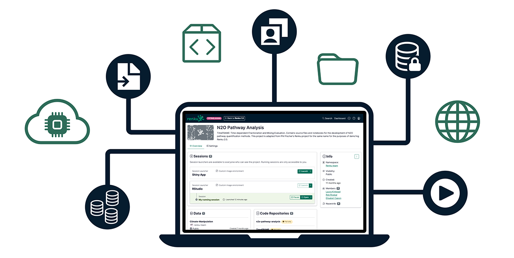
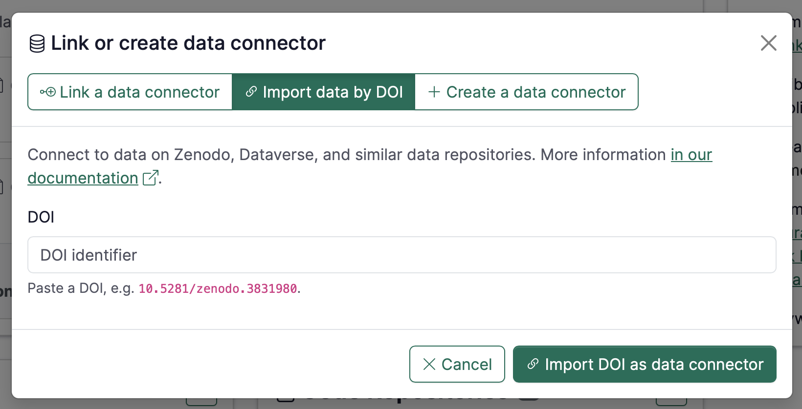
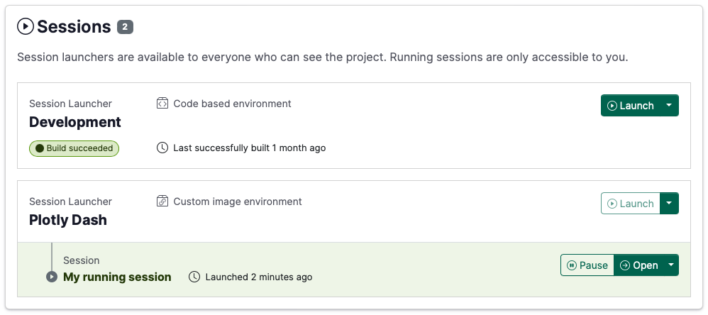
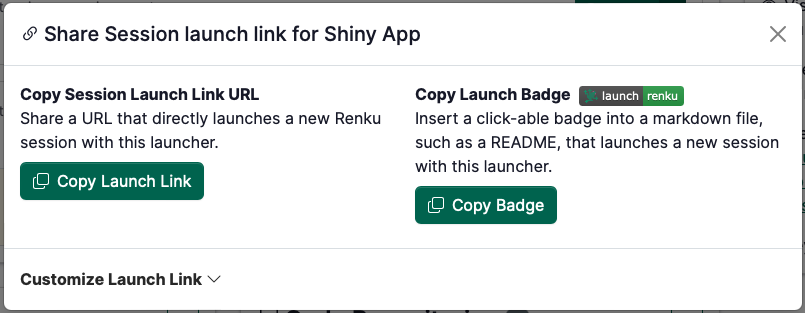
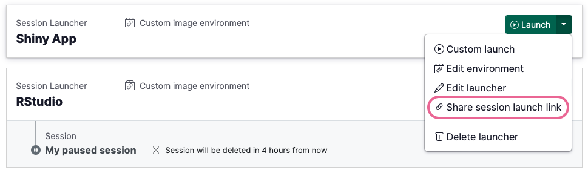
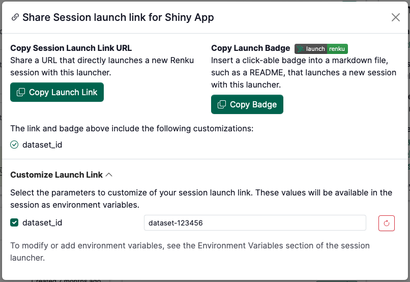
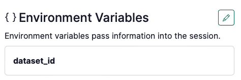
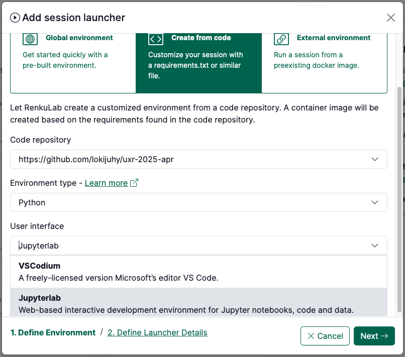

We've been busy building, and we're thrilled to share what we've been working on! This release
brings some of our most requested features to life, making it easier than ever to connect your data,
share your work, and dive straight into collaborative research.

<!-- truncate -->

## 🪄 Connect Data Repositories in Just a Few Clicks

Working with datasets from Zenodo, Dataverse, or other data repositories? We've got you covered. You
can now connect these datasets directly to your Renku project without the usual download-and-upload
dance.

Here's how simple it is: create a data connector using the new 'Import data by DOI' option, paste
your dataset's DOI, and you're done. The dataset automatically mounts in your Renku session, ready
to use. No more wrestling with file transfers or worrying about storage space.

Check out
the [documentation](https://renku.notion.site/Renku-2-0-How-To-Guides-900f417fc205439789a9fbdc5cadcec8?p=1eb0df2efafc802ab3bef1c47c8c45b4&pm=s)
to get started!

## ✨ A fresh look for Session Launchers

The session launcher interface has been completely redesigned with clarity in mind. We discovered
that users were getting confused about what aspects of their sessions were shared with collaborators
versus what remained private to their individual work.

The new design addresses this by splitting the interface clearly: the top section shows your session
launcher (the shared configuration that everyone on the project can see), while the bottom section
displays your personal session status. No more uncertainty about what affects your teammates and
what doesn't.

But the real game-changer? You can now see your code-based environment build status at a glance.
Previously, you had to open a side panel to check if your environment was still building, built
successfully, or failed. Now all that information—including when it was last built—is right there on
the main interface. This streamlines the workflow for our new [code-based
environments](../built-environments/) that let you define your computational
setup from a simple environment file.

## 🚀 Share Session Launch Links

Ever wanted to send someone a direct link to launch a session on your project? Maybe you're running
a workshop and want participants to jump straight into the analysis, or you've built a dashboard
that clients should access without navigating through project pages first.

Now you can create custom launch links that do exactly that. Share them as simple URLs or embed them
as colorful markdown badges—whatever fits your workflow.

You'll find the option in the launcher dropdown on your project page, or click the 🔗 icon in your
session controls if you're already working inside a session.

**Make Launch Links Even Smarter with Environment Variables**

Here's where it gets interesting: you can pass information directly to sessions through custom
launch links. Imagine you have a data catalog with dozens of datasets. Instead of creating separate
Renku projects for each one, create a single project with all your analysis tools, then generate
custom launch links that tell the session which dataset to load.

When someone clicks your custom link, the dataset ID gets passed as an environment variable that
your session can automatically pick up and use. One project, infinite possibilities.

Set this up by first adding environment variables to your session launcher, then customizing the
values when creating your launch link through the **Customize Launch Link** section.

## Jupyter now available for Code-Based Environments

Prefer Jupyter over VSCode? When creating [code-based
environments](../built-environments/), you can now choose your preferred
interface. Because the best tool is the one that fits your workflow.

## …and more!

This release also adds search functionality for data connectors and makes it possible to migrate
Renku Legacy (1.0) projects right from the Renku 2.0 dashboard. For the complete feature list, check
out our [release notes](https://github.com/SwissDataScienceCenter/renku/releases).

---

📺 Want to see these features in action? Watch these features demoed by the team who built them in the
[Renku Feature Preview • May 2025](https://www.youtube.com/watch?v=7vWJswq3zv0)!

💬 We love to hear your feedback! Share questions, ideas, and feedback with us on our
[forum](https://renku.discourse.group/).

🚀 This release marks the [official launch of Renku 2.0](../launch-renku-2/)! If you're curious about what new features
are coming up next, check out our
[roadmap](https://renku.notion.site/Roadmap-b1342b798b0141399dc39cb12afc60c9).
