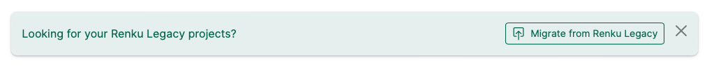
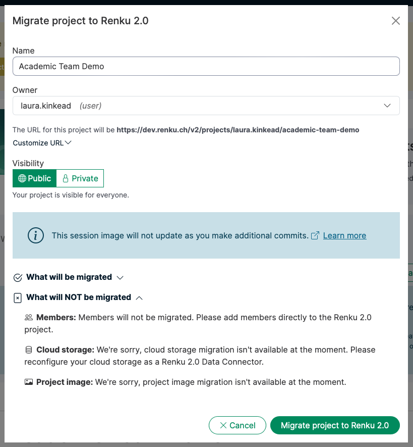

With the official launch of Renku 2.0, we're ready to sunset Renku Legacy (Renku “1.0”). Here's what
you need to know and what you need to do.


<!-- truncate -->

## What's Happening and Why

We're sunsetting Renku Legacy so we can focus all our development efforts on the new Renku platform.
This allows us to build new features faster and provide better support for our growing community.

:::info

Learn more about the new Renku platform and its enhanced capabilities in our
[launch announcement post](../launch-renku-2/).

:::

The sunsetting process has two parts:

1. **Sunsetting Renku Legacy (1.0)** - This refers to turning off all "legacy" Renku services and
   hosting of Renku 1.0 projects. We'll help you migrate projects to Renku 2.0, and going forward
   Renku Legacy projects will redirect to their migrated 2.0 counterparts.
2. **Shutting down the RenkuLab GitLab** - We'll help you move your code repositories to external
   providers like GitHub.com or GitLab.com, where they can continue to be connected with Renku 2.0
   projects.

## Timeline

We have planned a gradual process for sunsetting Renku Legacy to give you time to make the
transition with ease.

**July 2025: New project creation disabled in Renku Legacy**

- Existing Renku Legacy projects continue to work
- New project creation only available in Renku 2.0

**August 2025: Sessions disabled in Renku Legacy**

- You can view Legacy projects and migrate them to Renku 2.0
- To use computing sessions, projects must be migrated to 2.0

**October 2025: Renku Legacy fully turned off**

- Migrated projects will automatically redirect to Renku 2.0
- Links to Renku Legacy projects, for example those published in papers, will continue to work as
  long as the project has been migrated to Renku 2.0

**November 2025**: RenkuLab GitLab brownouts begin

- We'll start performing temporary planned outages (”brownouts”) for RenkuLab GitLab to encourage
  repository migration to external providers.

**January 2026**: RenkuLab GitLab decommissioned

- Repositories remaining there will no longer be accessible.

## What You Need to Do

### If you have Renku Legacy projects:

**Migrate them to Renku 2.0.** We've built tools to make this straightforward - It's really just 2
clicks! Your data, code, and project structure transfer over easily.

:::info

Want to know more about the differences between Renku Legacy and Renku 2.0? See our [Deep Dive
Comparison](../deep-dive-2-0/).

:::

:::tip

For a detailed guide for how to migrate your projects, see the [How to Migrate Projects from Renku
Legacy to Renku
2.0](./#how-to-migrate-projects-from-renku-legacy-to-renku-20)
guide at the bottom of this post.

:::

### If you have code in the RenkuLab GitLab:

**Move your repositories to external providers.** GitHub.com and GitLab.com are popular choices and
integrate seamlessly with Renku 2.0 projects. This actually makes your code more resilient since it
is no longer tied to our infrastructure.

:::tip

For a detailed guide for how to move your code repositories to other external providers, see the
[How to Move a Code Repository to an External
Provider](./#how-to-move-a-code-repository-to-an-external-provider)
guide at the bottom of this post.

:::

### For course instructors:

**Plan to use Renku 2.0 for fall semester courses.** Compute sessions will not be available in Renku
Legacy in the fall, so transition your course materials ahead of time.

## Getting Help

We're here to support you through this transition! Migration tools are designed to be user-friendly,
and you can find step-by-step guides for project and code repository migration right at the bottom
of this post. If you need specific help with migration or have other questions, our team is ready to
assist. You can write in our [forum](https://renku.discourse.group/) or send us an email at
[hello@renku.io](mailto:hello@renku.io).

---

## Appendix: Migration How To Guides

### How to Migrate Projects from Renku Legacy to Renku 2.0

You can migrate Legacy projects directly from the Renku 2.0 dashboard. Below the Projects section of
the dashboard, there's a card inviting you to migrate projects.



When you select a project to migrate, you will see an overview of how exactly each element of your
project will be migrated.



In addition, on Renku Legacy project pages, you'll see a banner at the top of the page inviting you
to migrate to 2.0, which will guide you through the same process.


To learn more about project migration, check out
our [documentation](https://renku.notion.site/Renku-2-0-How-To-Guides-900f417fc205439789a9fbdc5cadcec8?p=1ac0df2efafc80a88e58e2b3db035110&pm=s).

### How to Move a Code Repository to an External Provider

Here are the steps to migrate a code repository from the RenkuLab GitLab to a provider such as
[GitHub.com](http://GitHub.com) or GitLab.com:

1. Clone your repository from the RenkuLab GitLab to your local machine

   ```markdown
   git clone <renku-repo>
   ```

2. Create a new empty repository in your chosen provider (for example GitLab.com or GitHub.com)
3. Copy the clone URL for the new repository. We'll call this `new-remote`.
4. Run the following commands from inside the repository to push the repository to the new git
   repository provider.
   ```markdown
   cd <renku-repo>
   git remote add neworigin <new-remote>
   git push --all neworigin
   ```
