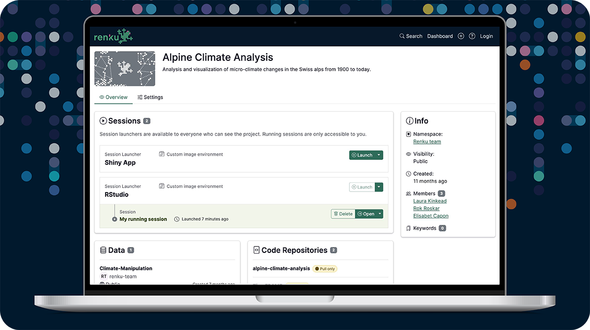

We're thrilled to announce that **Renku 2.0 is now officially launched!** We've rebuilt our platform
from the ground up with a fresh approach to collaborative research computing, and we're excited to
share what we've created.

<!-- truncate -->

## What is Renku 2.0?

Renku 2.0 represents a fundamental shift in how we think about research collaboration platforms.
While our original Renku aimed to be an all-in-one solution, Renku 2.0 takes a different approach:
it's designed as a **connection hub** that brings together your favorite tools, data sources, and
computing resources in one seamless experience.

At its core, Renku 2.0 is built around the concept of **external integrations** and **flexibility**.
Renku lets you connect your existing resources together —whether that's a GitHub repository, an S3
bucket, or a dataset from Zenodo— into a cohesive and shareable project.

## Want to Learn More? Join Our Community Events!

We'll be hosting a **[launch webinar on June 5th](../renku-2-launch/)** where
our team will walk you through Renku 2.0's key features, demonstrate the platform in action, and
answer your questions. [Register now](../renku-2-launch/) for this 1 hour
webinar!

In addition, we're hosting the third annual **[Renku Users
Meeting](../users-meeting-2025/) on June 23rd**. It's the perfect opportunity
to connect with other researchers, teachers, and data scientists passionate about collaboration.
This event is hybrid: in person in Bern and on Zoom. [Register
here](../users-meeting-2025/) to save your spot!

## How is Renku 2.0 Different from Renku Legacy?

The transformation from Renku Legacy to Renku 2.0 is substantial. In short, we've evolved from a
monolithic, all-in-one platform to a flexible, integration-focused approach that connects your
existing tools while lowering technical barriers for everyone involved in a data science project.

For a comprehensive deep-dive into these differences and what they mean for your projects, check out
our [detailed comparison blog post](../deep-dive-2-0/).

## What's Happening to Renku Legacy (”1.0”)?

Through Autumn 2025, Legacy will continue to be available. You can access Renku Legacy via the user
menu in the top right.

As we fully embrace the future with Renku 2.0, we'll be **[sunsetting Renku
Legacy](../sunsetting-legacy) over the next six months**. This includes shutting down the RenkuLab
GitLab instance in early 2026. We know transitions can feel daunting, but we're committed to making
this as smooth as possible.

**Important note for course instructors**: Please plan to use Renku 2.0 for your courses this autumn
semester rather than Renku Legacy. We'll provide comprehensive support, tools, and resources
throughout this transition to ensure you and your students have everything you need.

For complete details about the transition timeline and what it means for your projects, see our
[transition guide](../sunsetting-legacy).

## What's Next for Renku?

We're just getting started! The second half of 2025 holds some exciting developments:

- **External Compute Integrations**: We're working on connecting Renku with public cloud providers and
  HPC systems. Soon, you'll be able to link your cloud subscriptions directly with Renku, giving you
  complete control over your compute resources while enjoying our user-friendly interface. For HPC
  users, we're developing integrations that make these powerful resources more accessible and
  collaborative than ever.

- **Data Repository Integrations**: We're building stronger connections with data repositories,
  particularly those within the ETH Domain, making it easier to connect data sources into your
  research.

Curious about specific features and timelines? This blog is where we share [release
highlights](../release-2025-05), and you can check out our [public
roadmap](https://renku.notion.site/Roadmap-b1342b798b0141399dc39cb12afc60c9) to see exactly what's
coming in the next few months.

## Ready to Get Started?

Renku 2.0 is now the default Renku experience, and we can't wait for you to explore what's possible.
Whether you're starting a new research project or thinking about transitioning existing work,
our [comprehensive documentation](https://renku.notion.site/Documentation-db396cfc9a664cd2b161e4c6068a5ec9) and [hands-on
tutorial](https://renku.notion.site/Renku-2-0-Tutorials-1460df2efafc80c2b27acd221aa34a24?p=1a50df2efafc800f8554e30fd7458fa6&pm=s) will help you hit the ground running.

---

The journey to Renku 2.0 has been incredible — from our beta release after just six months, to early
access for our community after a year, and now to this full launch at eighteen months. We're
immensely proud of what we've built together, and we're even more excited about what comes next.

Welcome to Renku 2.0! 🎉
