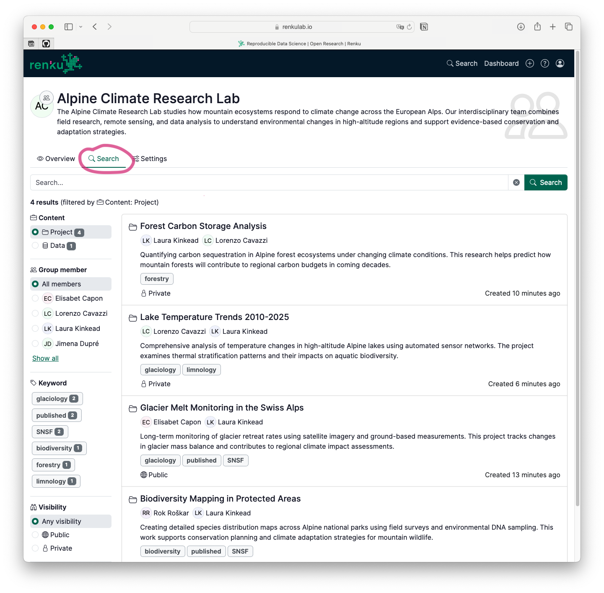
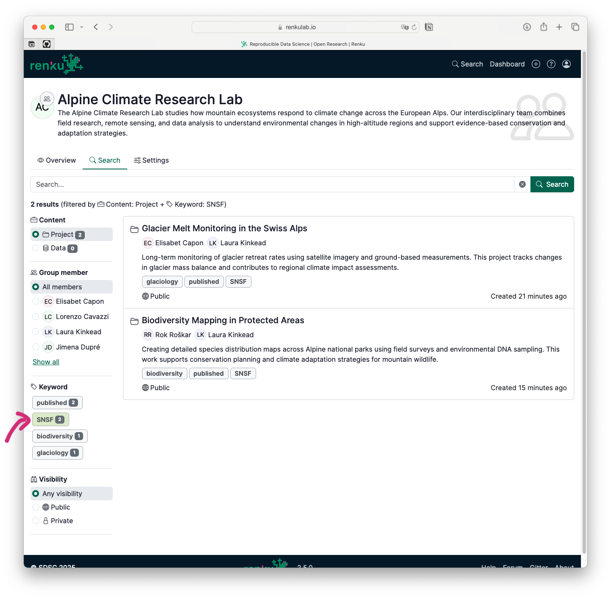
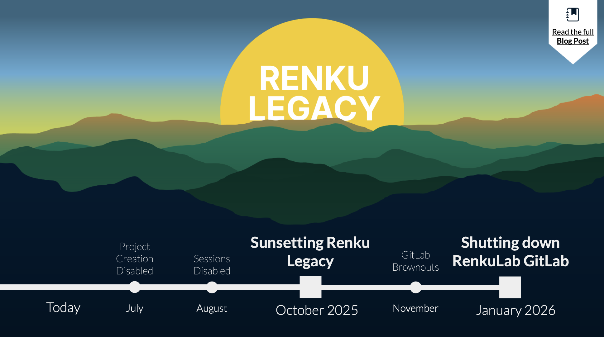
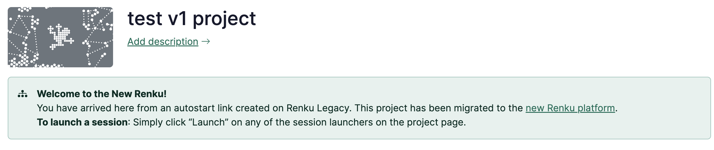

We've been hard at work making Renku Groups more powerful and continuing the smooth transition from
Renku Legacy. This release adds much-needed search functionality to groups and includes helpful
updates for users migrating from Renku Legacy.

<!-- truncate -->

## 🔍 Organize and Share your Group's Projects and Data

Whether you're a **lab manager** who needs to oversee all the projects in your group, a
**researcher** who wants to discover and reuse work from across your team, or a **group leader** who
wants to showcase the output of your group in a FAIR manner, Renku group pages make organizing,
discovering, and sharing research content simple.

Find the new group search in a tab near the top of your group pages.

### Search by Everything That Matters

The new group search goes beyond just finding projects and data by name. You can now:

- **Filter by project members**: Find all projects a specific lab member is working on with a single
  click.
- **Search by keywords**: Organize your projects and data connectors by topic, status, funding
  source, or any other categorization that makes sense for your team.

### Showcase Your Research

You can share your group page with anyone — even outside of Renku — and they'll be able to browse
all your public projects and jump straight into interactive sessions. It's research sharing made
simple.

Even better, you can create filtered views and share direct links that highlight specific content.
Want to show a funder all projects related to a particular keyword? Or demonstrate your lab's work
in a specific research area? Just create a filtered view and share the link.

### 🏷️ Keywords for Data Connectors

As part of our broader effort to improve content organization, you can now add keywords to data
connectors, just like you can for projects.

## 🌅 Renku Legacy Transition: Migrate your Projects by October for continued access

Our transition from Renku Legacy continues on schedule, with a helpful new feature that makes the
migration even smoother. As a reminder of where we are in the sunsetting process:

- ✅ **July 15, 2025**: We turned off the ability to create new projects and datasets in Renku
  Legacy.
- **August 2025**: We will disable sessions in Renku Legacy.
- **October 2025**: Renku Legacy will be fully turned off. [Migrate your
  projects](https://blog.renkulab.io/sunsetting-legacy/#how-to-migrate-projects-from-renku-legacy-to-renku-20)
  to maintain access!

### Old Links, New Destination

**New: Session autostart links from Renku Legacy now automatically redirect to Renku 2.0** when the
project has been migrated. To create new autostart links in Renku 2.0, use [Renku Launch
Links](https://blog.renkulab.io/release-2025-05/#share-session-launch-links).

Links to Renku Legacy projects will also automatically redirect to Renku 2.0 when Renku Legacy is
shut down in October. This means that bookmarks, published links, and embedded URLs will continue to
work seamlessly. However, these redirects will only work for migrated projects, so make sure to
**[migrate your projects to Renku 2.0 before
October](https://blog.renkulab.io/sunsetting-legacy/#how-to-migrate-projects-from-renku-legacy-to-renku-20)**!

### Need Help with the Transition to Renku 2.0?

For complete information about the Renku Legacy sunset process, including migration guides and
timelines, visit our dedicated [transition guide](https://blog.renkulab.io/sunsetting-legacy/).

## …and more!

This blog post covers the highlights from releases `2.1.0` to `2.5.0`. For detailed technical release
notes and the complete feature list, check out our releases on
[GitHub](https://github.com/SwissDataScienceCenter/renku/releases).

---

🐸 Ready to get started? Hop into [renkulab.io](https://renkulab.io) and get a jumpstart with our [documentation](https://renku.notion.site/Documentation-db396cfc9a664cd2b161e4c6068a5ec9).

📺 Want to see these features in action? Watch these features demoed by the team who built them in the
[Renku Feature Preview • July 2025](https://www.youtube.com/watch?v=dUJS7_hH1YY)!

💬 We love to hear your feedback! Share questions, ideas, and suggestions with us on our
[forum](https://renku.discourse.group/).

🚀 Curious about what's coming next? Check out our
[roadmap](https://renku.notion.site/Roadmap-b1342b798b0141399dc39cb12afc60c9) to see what new
features we're working on.
