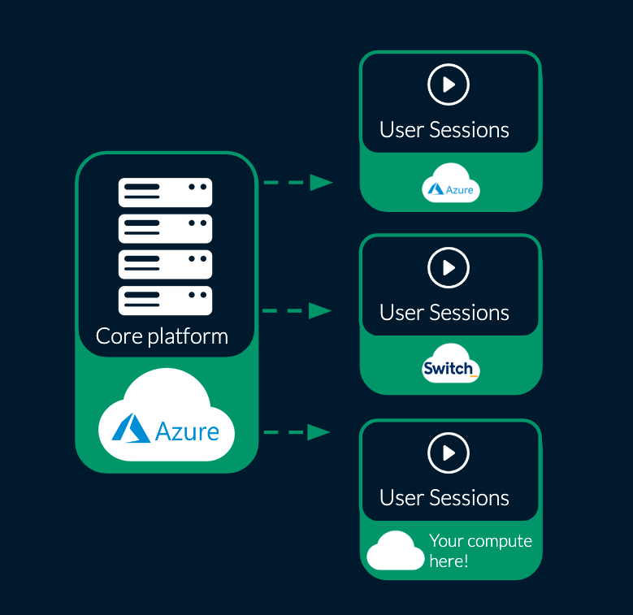

On August 21, our team executed a major maintenance on our production cluster running at
[renkulab.io](http://renkulab.io) - the entire platform was moved from the servers in Switch Engines
to its new home in the Microsoft Azure Switzerland-North datacenter. This was a major operation that
took many weeks to plan and in the end resulted in just a few hours of downtime - a huge congrats to
our operations team on making everything work so smoothly!

<!-- truncate -->

## Why change cloud providers?

Since 2018, we have operated [renkulab.io](http://renkulab.io) (and our development infrastructure)
on Switch Engines hosted here in Zürich. This suited our needs for quite some time and we very much
appreciated the help and responsiveness of the Switch Engines team during the years when Renku was
growing.

However, as our user-base and use-cases grew, so have the demands for rather complex compute
configurations that could no longer be met flexibly in our existing configuration. Furthermore, the
usage on [renkulab.io](http://renkulab.io) was often very “peaky”, meaning that a lot of resources
were needed for a few hours a day (e.g. large courses or workshops) and far fewer the rest of the
time. We did the best we could to manage costs by scaling our infrastructure manually, but this
meant that either sometimes users could not get access to resources quickly enough, or we had to
leave things over-provisioned.

As a result, we decided to migrate our base platform to an infrastructure that affords us the
flexibility our users require while also giving us the tools we need to optimize costs.

## Can we continue using Switch (or other cloud) resources?

Yes! Recently we completed a big feature that allows us to connect [renkulab.io](http://renkulab.io)
to external compute resources. This means that those users who already have Switch subscriptions and
would like to keep using those resources with the convenience of the Renku interface can absolutely
do so! We are also making a joint effort with Switch engineers to make this integration as seamless
as possible.

Similarly, those with existing Azure or other cloud subscriptions can also take advantage of this
integration possibility and integrate their own resources into [renkulab.io](http://renkulab.io)
that can then be used by group or collaboration members.

We will have more information on this shortly, but if you are interested in this feel free to reach
out to us at [hello@renku.io](mailto:hello@renku.io).

A huge thanks once again to the Switch Engines team who supported us over the past few years; we
look forward to building up this next, cloud-agnostic iteration of the Renku platform!

---

🐸 Ready to get started? Hop into [renkulab.io](https://renkulab.io) and get a jumpstart with our
[documentation](https://renku.notion.site/Documentation-db396cfc9a664cd2b161e4c6068a5ec9).

💬 We love to hear your feedback! Share questions, ideas, and suggestions with us on our
[forum](https://renku.discourse.group/).
