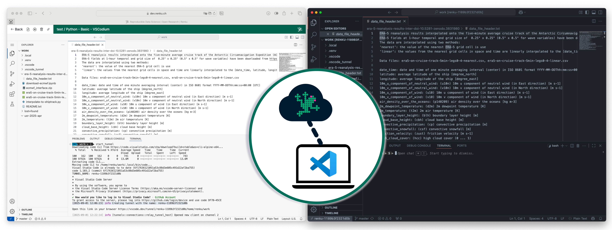
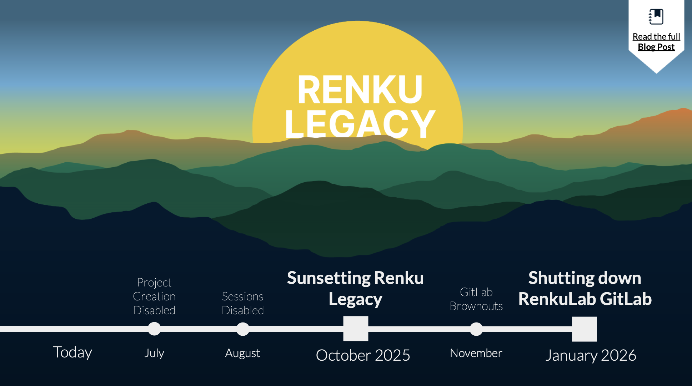

We're excited to share what's new in Renku this month, including a feature many of you have been
asking for, plus some important reminders about the end of Renku Legacy coming up in only 2 months!

<!-- truncate -->

## Work in Your Favorite Local VSCode Setup

You can now connect to your Renku sessions directly from your local VSCode application! We know many
of you prefer working in your customized VSCode environment on your laptop rather than in the
browser. Now you can have the best of both worlds: Renku's collaborative compute power with your
personalized local development setup.

Getting connected is straightforward - just run a simple `start_tunnel` command inside your Renku
session to establish the connection to your local VSCode. You'll find step-by-step instructions in
our [documentation](https://www.notion.so/How-to-connect-to-a-Renku-session-from-your-local-VSCode-25d0df2efafc8013a04cc5cc5d2ee33b?pvs=21).

## Renku Legacy and GitLab Shutdowns start in 2 Months

We have two critical deadlines coming up that require your attention:

### Renku Legacy Shutdown: October 28, 2025

Time is running short! Renku Legacy will be shut down in just **2 months** on October 28. If you
still have projects on the old platform, you need to migrate them before this date to maintain
access. The good news? Our built-in migration tool makes this process quick and easy - you'll find
built in migration tools on your Renku 2.0 dashboard and on Renku Legacy project pages.

### RenkuLab GitLab Shutdown: January 2026

The second phase of our transition is also approaching. In January 2026, we'll be shutting down the
RenkuLab GitLab instance. This means you need to move your code repositories to external git
providers like GitHub or GitLab.com (both integrate seamlessly with Renku!). You'll find complete
step-by-step migration instructions in our [transition
guide](https://blog.renkulab.io/sunsetting-legacy/).

**New feature alert:** Want your old `gitlab.renkulab.io` repository links to automatically redirect
to your new repository? You can now [register your new repository
location](https://www.notion.so/2540df2efafc80a2bee5f1b7d247c28e?pvs=21) and we'll set up automatic
redirects for you.

## We've Moved! RenkuLab's New Home in Microsoft Azure

Here's some behind-the-scenes news that might interest you: On August 21, RenkuLab successfully
moved from Switch Engines to its new home in Microsoft Azure's Switzerland-North datacenter. This
was a massive undertaking that our operations team executed brilliantly, resulting in only a few
hours of downtime despite months of preparation. Our new home cloud affords us the resource
flexibility our users require while also giving us the tools we need to optimize costs.

Curious to learn more about why we made this change or wondering if you can still run your Renku
sessions on Switch infrastructure? (spoiler- yes you can!) We've got all the details in our
dedicated [blog post about the migration](../renku-hops-across-clouds).

## …and more!

This blog post covers the highlights from releases `2.6.0` to `2.7.0`. For detailed technical
release notes and the complete feature list, check out our releases on
[GitHub](https://github.com/SwissDataScienceCenter/renku/releases).

---

🐸 Ready to get started? Hop into [renkulab.io](https://renkulab.io) and get a jumpstart with our
[documentation](https://renku.notion.site/Documentation-db396cfc9a664cd2b161e4c6068a5ec9).

💬 We love to hear your feedback! Share questions, ideas, and suggestions with us on our
[forum](https://renku.discourse.group/).

🚀 Curious about what's coming next? Check out our
[roadmap](https://renku.notion.site/Roadmap-b1342b798b0141399dc39cb12afc60c9) to see what new
features we're working on.
