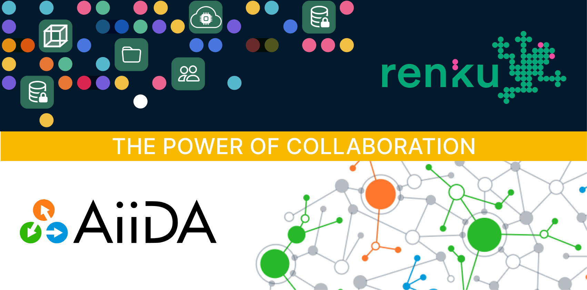
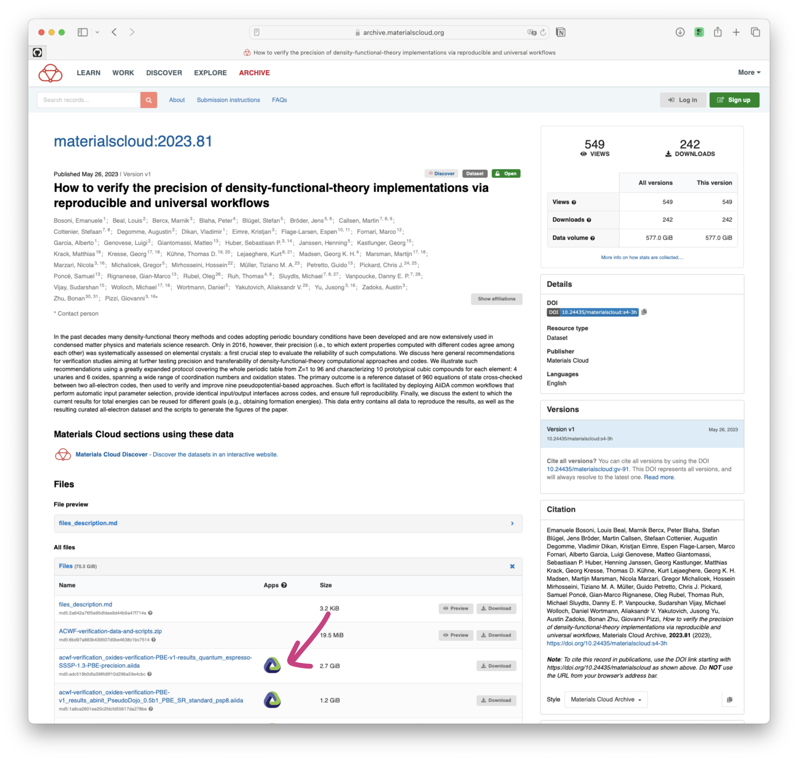
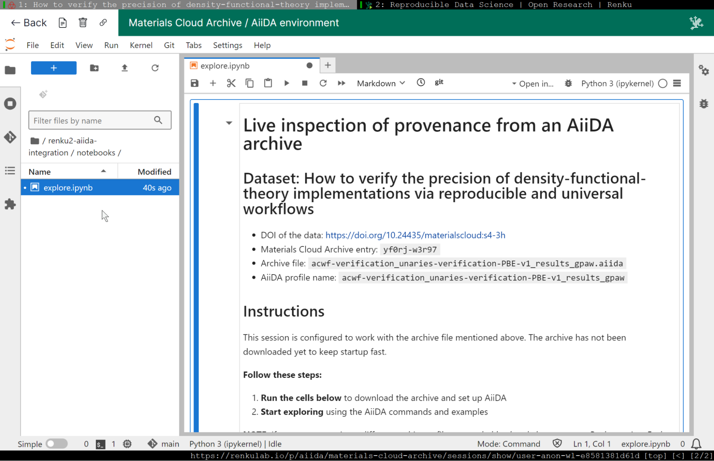
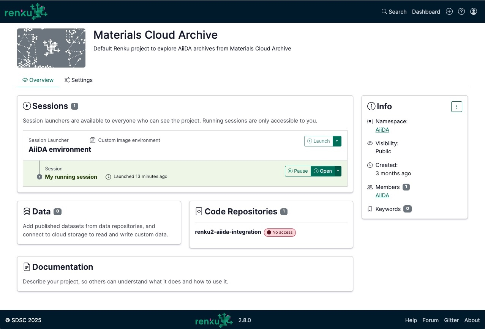

From technical local setup to one-click data exploration: How the Materials Cloud Archive simplified
researcher access to computational materials science data using RenkuLab.

<!-- truncate -->

## The Challenge: Valuable Data Behind Technical Barriers

Computational science generates valuable data that can accelerate research—given that it’s
accessible to the community at large. This is where the [Materials Cloud
Archive](https://www.materialscloud.org/home)  (MCA) was facing a bit of an issue: while the
platform was hosting plenty of computational (materials science) research data, accessing it
required a rather technical local setup, not accessible to everyone.

This is because the data consists of archives created using the AiiDA workflow manager, and,
"exploring AiiDA archives historically required users to install AiiDA locally with complex
dependencies like PostgreSQL and RabbitMQ," the development team explains. For this reason "users
also needed prior knowledge of AiiDA's API to explore the data."

The complexity meant valuable research data was effectively locked away from researchers who weren't
already familiar with AiiDA. And even experienced users had to manually download archives, configure
environments, and set up profiles before beginning actual research—wasting time that could be spent
on discovery.

## The Solution: One-Click Access with Renku Launch Links

Due to their shared commitment to research data provenance and shared Swiss origins, the AiiDA and
Renku development teams have been in touch as early as 2019. The first integration was achieved
by creating a template Renku project with AiiDA pre-installed. The connection between the two platforms
was then achieved via parameterized [launch
links](https://blog.renkulab.io/release-2025-05/#share-session-launch-links) that pass specific
MCA dataset archive IDs directly into Renku sessions.

Now, researchers simply click the Renku logo next to any AiiDA archive on MCA and are automatically
launched into a fully configured environment with their selected data ready for exploration.

**Evolution to Renku 2.0:** The recent upgrade to Renku 2.0 brought significant improvements to the
integration. The new implementation features:

- True one-click access without intermediate Renku project creation steps
- Faster startup times by deferring downloads until needed
- Intelligent customization using archive metadata
- Enhanced notebooks with AiiDA API examples

You can explore the current implementation on
[RenkuLab](https://renkulab.io/p/aiida/materials-cloud-archive), and learn more about the technical
details of the integration on the [AiiDA
website](https://www.aiida.net/news/index/category/blog.html).

## The Impact: Lowering the Barrier to Access

What once required complex local installations, prior AiiDA knowledge, and manual configuration
steps is now accessible with a single click. Researchers can discover data on MCA and immediately
explore it interactively without any local setup or risk of modifying their existing installations.

"Without the infrastructure provided by Renku, the first working online deployment would likely have
been achieved much later," notes the development team. While they've also been working on
alternative solutions like an AiiDAlab demo server, the Renku integration was established five years
ago and continues to evolve—demonstrating the value of leveraging existing platforms rather than
building from scratch.

## Looking Forward: Expanding the Partnership

The AiiDA team is exploring further expansions using Renku 2.0's new capabilities:

**Expanding data access via Renku Data Connectors:** The AiiDA team is exploring Renku 2.0's new
data connectors to mount MCA archives directly in project filesystems, which would eliminate
download times and storage limitations—crucial for large archives like a recent 15TB AiiDA project.

**Supporting the broader AiiDA App Ecosystem:** With Renku 2.0's support for arbitrary Docker
images, they're exploring integrating other AiiDA applications like the Quantum ESPRESSO GUI.
Hosting these apps on RenkuLab could reduce their own maintenance overhead.

## The Power of Collaboration

"Keep it simple- Why re-invent the wheel when a fitting solution already exists? Often it's better
to invest time finding and familiarizing yourself with existing solutions rather than recreating
your own." says the AiiDA team. "Renku has been very stable throughout the various steps of the
integration. Their team has always been responsive and super helpful with any concerns or technical
difficulties."

By removing barriers between data discovery and analysis, RenkuLab enables more researchers to
engage with computational datasets, ultimately accelerating scientific discovery.

The Materials Cloud Archive integration demonstrates how research infrastructure can evolve from
serving primarily expert users to welcoming the broader scientific community—turning technical
barriers into bridges for collaboration and discovery.

---

_Want to learn more about how Renku can help democratize access to your research data? [Explore
RenkuLab](https://renkulab.io/) or [contact our
team](https://renku.notion.site/Contact-dd098db288ff433893a4d4d429da99c1) to discuss your use case._
