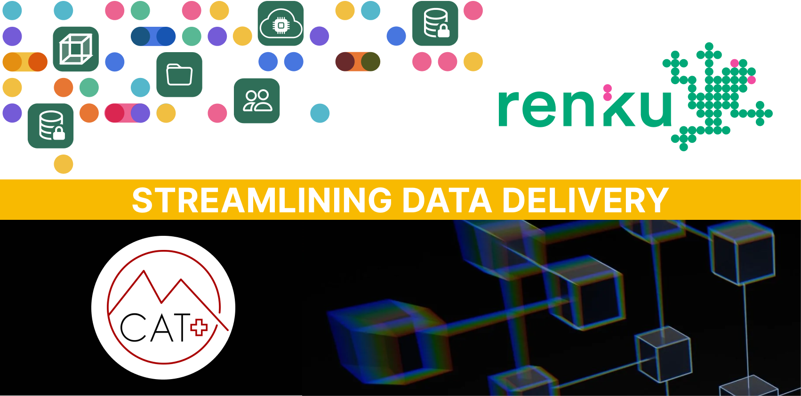
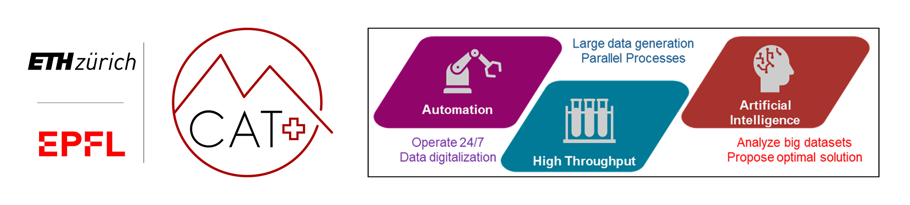
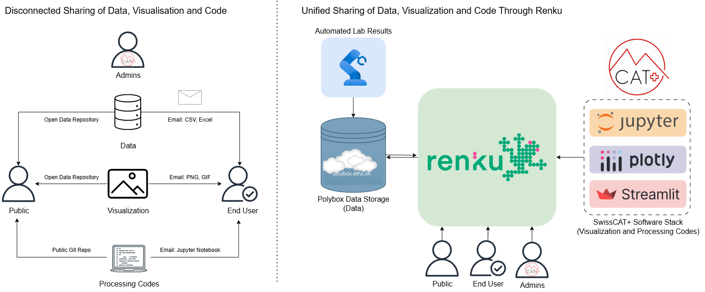
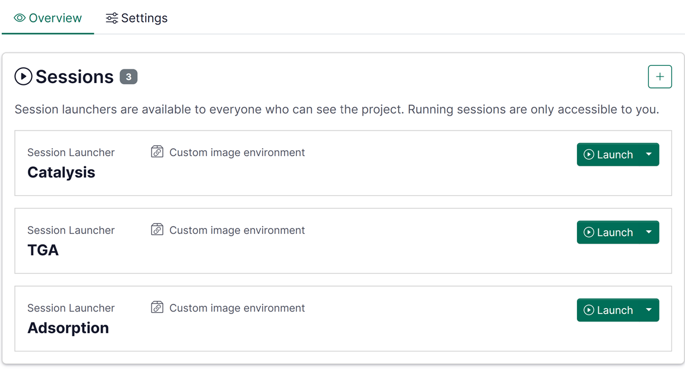
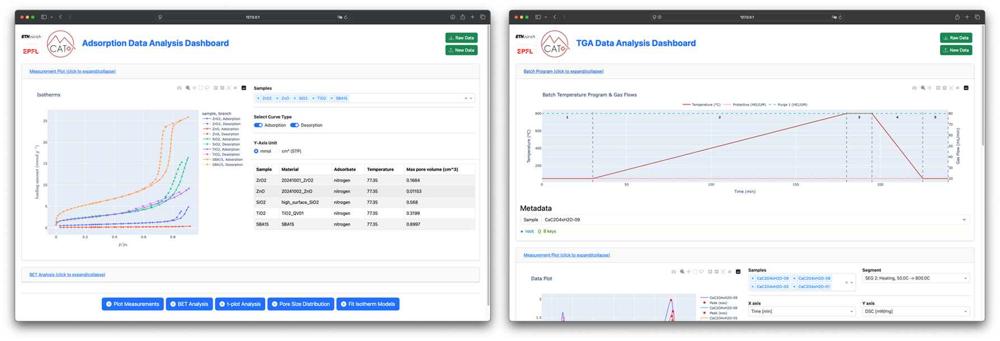

As one of the projects within the first SDSC national call, [ETHZ
SwissCAT+](https://swisscatplus.ethz.ch) teamed up with the SDSC to utilize their
[Renku platform](https://renkulab.io) to unite data, code and compute in their **OpenCatData**
project. In this blog post we describe how ETHZ SwissCAT+ fully utilizes the features that Renku
offers to augment how data can be effectively shared across different parties.

<!-- truncate -->

## ETHZ SwissCAT+'s Challenge

ETHZ SwissCAT+ is a technology platform that provides services to researchers in the field
of catalysis. At ETHZ SwissCAT+, traditional catalysis research is complemented with high-throughput
experimentation, automation and artificial intelligence thereby generating large amounts of data.
With a diverse user base from various academic institutions and companies nationally and
internationally, ETHZ SwissCAT+ faces the challenge to effectively communicate and share the
obtained experimental data with their user base.

## Renku Platform as Solution

Renku offers an ideal platform to overcome this challenge where it allows to connect:

- Data created from the instruments at ETHZ SwissCAT+,
- Data processing tools developed at ETHZ SwissCAT+
- Compute resources to deploy the data processing tools

## Data management Integration to Renku

Data generated at ETHZ SwissCAT+ are stored in a data repository (for example polybox) and codes are
located on a git repository. A Renku project can be created that connects the data and the code and
uses the cloud resources provided by the Renku platform to deploy them. With a single Renku project,
multiple sessions can be created for accessing data and code resources in various combinations and
with different visualization and analysis tools. Renku offers the possibility to create templates to
further speed up the creation of new Renku projects.

Previously, users were responsible for setting
up their own computational environment for reviewing the data and code results provided by ETHZ
SwissCAT+. Now with Renku, they only need to create a user account and be granted the access rights
to their data and the processing tools, and they can launch interactive Renku sessions directly in
the browser.

### Catalysis Performance & Characterization Data Visualization

So far three primary session templates have been implemented at ETHZ SwissCAT+. Each session is used
in combinations with different data sources and creates interactive visualization dashboards to
visualize results from:

- Catalyst testing
- Thermogravimetric analysis
- Gas adsorption/desorption

Each session comes with its tailored data processing tools. For example, catalyst testing data can
be aggregated and filtered, gas adsorption/desorption data are further fitted using various
mathematical models to extract descriptors from the data, and thermogravimetric analysis data can be
processed to obtain integrated areas, peak maximum etc from their sequential data.

## Summary

Renku has significantly enhanced the user experience for the groups that are requesting services
provided by ETHZ SwissCAT+ which faces the challenge in sharing large amounts of diverse data to
multiple users. In the wake of big data and open science, Renku offers the ideal and timely platform
for this purpose. Check out some public Renku projects created by ETHZ SwissCAT+:

- [Data Visualization Dashboard for Swiss Cat+ East A1 project](https://renkulab.io/p/swisscat/a001)
- [Calcium Oxalate TGA Analysis](https://renkulab.io/p/swisscat/calcium-oxalate-tga)
- [Commercial Supports Gas Adsorption/Desorption Measurements](https://renkulab.io/p/swisscat/commercial-supports-bet-measurements)

---

_Want to learn more about how Renku can help democratize access to your research data? [Explore
RenkuLab](https://renkulab.io) or [contact our
team](https://renku.notion.site/Contact-dd098db288ff433893a4d4d429da99c1) to discuss your use case._
