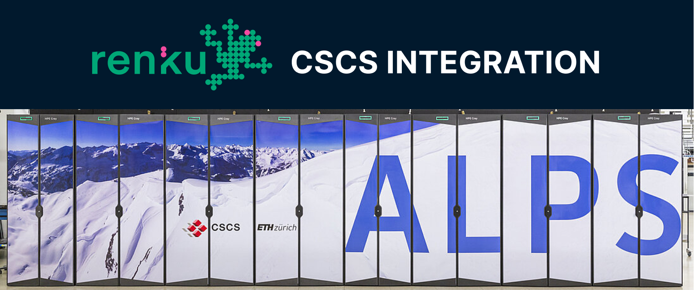

New in Renku this month: We've combined Renku's super-simple sessions with the power of
supercomputing!

<!-- truncate -->

## 🚀 Launch Renku Interactive Sessions on CSCS

You can now launch Renku sessions directly on the Swiss National Supercomputing Center (CSCS)! This
feature was broadly requested by our community via the [SDSC Call for
Collaborations](https://www.datascience.ch/call-for-projects) in 2024 to help lower the barrier to
entry to using Switzerland's state of the art computing infrastructure.

**No SSH, no SLURM, no container headaches.** Starting a Renku session on CSCS is exactly as easy as
starting a regular Renku session: just click launch! Renku handles all the complexity— including
managing job submissions and building CSCS-compatible containers for your project environment— so
you can focus on your research.

### Get Started with Renku on CSCS

This is an MVP release with limited access. If you'd like to get started, [register for
access](https://www.notion.so/2810df2efafc803a8175ccd2d472b23d?pvs=21) to the Renku:CSCS
Integration!

First, connect your existing CSCS account to RenkuLab via the [Renku Integrations page](https://renkulab.io/integrations?targetProvider=cscs.ch).

Create launchers that use CSCS resources by selecting a Renku CSCS resource class (access to these
resource classes requires
[registration](https://www.notion.so/2810df2efafc803a8175ccd2d472b23d?pvs=21)). Then, simply click
'launch' and jump into sessions that look and feel exactly like regular Renku sessions, but with
access to your CSCS compute resources and data!

:::info

Sessions consume your own CSCS account resources, not a shared Renku resource pool.

:::

To learn more about how the Renku:CSCS integration works and what you can do with it, check out
our [RenkuLab:CSCS Integration info
page](https://www.notion.so/RenkuLab-CSCS-integration-28f0df2efafc80979af6d74ff8238fcc?pvs=21).

**What's next?** We're continuing to develop this integration, with our next goal being simplified
support for CSCS's ARM clusters, including Daint.

## 🔐 Private Docker Images in Sessions

You can now use docker images from private code repositories in your Renku sessions! Previously, the
"External Environment" launcher type only supported public images. Now you can connect private
images from GitHub or GitLab container registries.

To get started, create a Session Launcher in External Environment mode and enter your image
reference. Renku will let you know if you need to activate any additional integrations to connect to
the image.

**Access control stays where it belongs.** Each person's ability to launch the session depends on
their access rights to the image in the source system— connecting a private image to a Renku project
doesn't grant anyone new access.

Note that configuring custom images requires some setup. Check out our [detailed documentation
guide](https://renku.notion.site/Renku-How-To-Guides-900f417fc205439789a9fbdc5cadcec8?p=11f0df2efafc80af848ffcaf9ccff31c&pm=s) for
help getting your image configured correctly.

## …and more!

This blog post covers the highlights from releases `2.7.1` to `2.9.0`. For detailed technical
release notes and the complete feature list, check out our releases
on [GitHub](https://github.com/SwissDataScienceCenter/renku/releases).

---

_Image courtesy of CSCS, licensed under [CC BY-SA 3.0](https://creativecommons.org/licenses/by-sa/3.0/deed.en)_

🐸 Ready to get started? Hop into [renkulab.io](https://renkulab.io) and get a jumpstart with our
[documentation](https://renku.notion.site/Documentation-db396cfc9a664cd2b161e4c6068a5ec9).

💬 We love to hear your feedback! Share questions, ideas, and suggestions with us on our
[forum](https://renku.discourse.group/).

🚀 Curious about what's coming next? Check out our
[roadmap](https://renku.notion.site/Roadmap-b1342b798b0141399dc39cb12afc60c9) to see what new
features we're working on.
