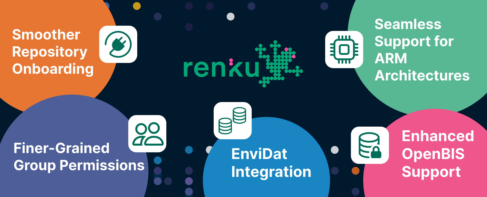
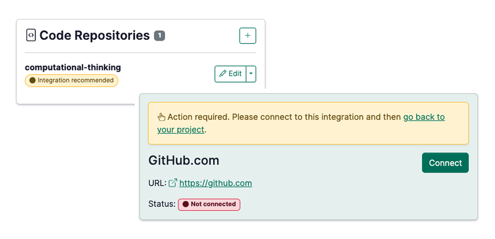

New in Renku for the New Year: We have added new integrations with research data repositories for
frictionless data reuse, made it possible to build images for arm architectures, and improved collaboration flows!

<!-- truncate -->

Happy 2026, Renku community! 🚀

We hope you all had a refreshing break. While the year is just getting started,
the Renku team was busy through the end of 2025 wrapping up some impactful
features designed to make your collaborative research even smoother.

From better hardware support to more precise permission settings, here is a look
at what’s new in **Renku releases 2.10.0 through 2.12.0.**

## Expanding Data Access: New Connectors for EnviDat and OpenBIS

We are thrilled to expand Renku’s "connecting hub" capabilities with two highly
requested data integrations that make bringing your research data into your
compute environment even faster.

### EnviDat Integration

Working with EnviDat, the environmental data portal of the Swiss Federal Research
Institute WSL, is now effortless.

**How it works**: Simply copy a dataset’s DOI and [create a Renku data connector](https://docs.renkulab.io/en/latest/docs/users/data/guides/connect-data/connect-data-from-data-repositories#how-to-connect-a-dataset-from-a-data-repository-to-a-renku-project) in your project.

**The Benefit**: Renku automatically syncs the metadata, making the data searchable within Renku (just like our Zenodo and Dataverse integrations). After setting the new data connector, when you launch a new session the data is automatically mounted, ready for immediate analysis without manual downloads.

### Enhanced OpenBIS Support

For researchers using openBIS, we’ve introduced a dedicated [data connector type](https://docs.renkulab.io/en/latest/docs/users/data/guides/connect-data/connect-to-openbis)
to streamline navigation and data fetching. You can configure your connector to point to a specific
dataset in the openBIS instance for easier sharing. This solution offers an alternative to directly using [openBIS APIs](https://openbis.readthedocs.io/en/20.10.0-11/software-developer-documentation/apis/index.html) from within code (e.g. [pyBIS](https://openbis.readthedocs.io/en/20.10.0-11/software-developer-documentation/apis/python-v3-api.html) for Python).

**Note on connectivity**: Many openBIS instances are hosted behind institutional firewalls. If you encounter any issues connecting to your instance from Renku, please reach out to us! We’re eager to help you get your data flowing smoothly.

We are grateful for the support of the [ETH Domain Open Research Data program](https://ethrat.ch/en/eth-domain/open-research-data/), which made the development of these
integrations possible through project funding in Measure 2.

## 💻 **Seamless Support for ARM Architectures**

If you are working on a modern Mac (Apple Silicon) or running heavy workloads on
HPC clusters like Alps (Daint) on CSCS, you know that architecture matters.

We’ve now automated the image-building process for **arm64**. When configuring
[your launcher](https://docs.renkulab.io/en/latest/docs/users/sessions/guides/create-environment-with-custom-packages-installed#how-to-create-a-code-based-environment-for-your-renku-session), simply select the appropriate architecture, and Renku will
automatically build the correct image for you. To save you from troubleshooting
headaches, we’ve also added a warning if you attempt to launch an image on an
incompatible compute resource.

## 👥 **Finer-Grained Group Permissions**

We’ve refined how Group roles work to give you more control over your
collaborative spaces.

- **The Change:** Previously, Group Editors had full administrative reach over
  all projects within a group.
- **The New Way:** Group Editors can now add new projects to a group, but they
  **cannot** modify the settings of projects they don't personally own.
- **The Benefit:** This creates a clearer boundary for large teams, ensuring
  that only Project Owners and Group Owners remain in control of critical project
  configurations.

## 🔌 **Smoother Repository Onboarding**

Many of you rely on our GitHub and GitLab integrations to keep your code in
sync. We heard your feedback that it wasn't always clear if an integration was
fully "active" until you were already inside a session—only to realize you
couldn't push your code.

Now, Renku provides a **clearer signal before you launch**. If an integration is
available but your credentials aren't linked, you'll see a prompt to connect
them first. This ensures you enter your session ready to work, with all the
permissions you need from the get-go.

## 🔗 **Preserving Your Research: Legacy GitLab Redirects**

With the [shutdown of Renku’s legacy GitLab
instance](https://blog.renkulab.io/release-2025-09/#renkulab-gitlab-shutdown-january-2026)
(`gitlab.renkulab.io`) coming at the end of this month, we want to ensure your
published work remains accessible.

If you have moved a repository to a new home (like GitHub or our new GitLab
instance) and want to ensure old links—such as those in published papers—don't
break, we can help. Simply [**fill out this
form**](https://www.notion.so/2540df2efafc80a2bee5f1b7d247c28e?pvs=21) with your
new repository location, and we will automatically redirect visitors from the
old URL to the new one.

## **Full Release Notes**

While these are the highlights, there were many other smaller fixes and
performance tweaks in these releases. For the curious, you can find the full
technical breakdown on our [GitHub Releases
page](https://github.com/SwissDataScienceCenter/renku/releases).

---

**Have questions about these updates?** Reach out to us on our [community forum](https://renku.discourse.group/)!

🐸 Ready to get started? Hop into [renkulab.io](https://renkulab.io) and get a jumpstart with our
[documentation](https://docs.renkulab.io).

💬 We love to hear your feedback! Share questions, ideas, and suggestions with us on our
[forum](https://renku.discourse.group/).

🚀 Curious about what's coming next? Check out our
[roadmap](https://renku.notion.site/Roadmap-b1342b798b0141399dc39cb12afc60c9) to see what new
features we're working on.
