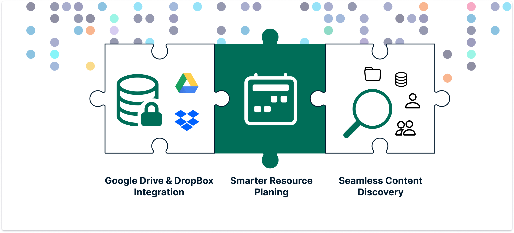

Our mission is to make collaborative data science seamless, regardless of where your data lives or how you choose to compute. Our latest release, 2.15.0, brings us a step closer to that goal with some highly requested data integrations and powerful tools for project admins.

<!-- truncate -->

The Renku team has started this year working on new impactful features which provide more possibilities to your collaborative work
and improve your user experience. Here’s the breakdown of what the team has released already this month.

## 📂 **Google Drive, Dropbox now easily linked to your projects**

Over the past year, we’ve been steadily expanding the ecosystem of data sources you can bring into your Renku projects. In addition to various cloud storage options, we have also made it easy to pull from research archives like **Zenodo** and **Dataverse**, as well as domain-specific repositories like **EnviDat** and **openBIS**.

Now, we’re expanding this even further and making it possible to connect **Google Drive** and **Dropbox** directly to your projects!

> **How it works:** Simply create a connector in your project settings, activate the integration, and you’re good to go. Your files will be ready for you the next time you launch a session.
>
> _Check out our [documentation](https://docs.renkulab.io/) for the step-by-step guide._

## 🔍 **Find What You Need, Faster**

We’ve given our search pages a makeover! We streamlined the interface and improved the underlying logic to help you find projects, datasets, and groups more intuitively. Whether you are looking for a teammate’s specific workflow or a public data connector to use, the experience is now much smoother.

## 🗓️ **Admins: Stress-Free Event Planning**

Running a course or a hackathon? Now the platform infrastructure can be **automatically scaled** to accommodate all participants instantly.

No more waiting for resources to get provisioned while your students sit idle; just register the course or event and we’ll take care of the rest.

- **Are you an Administrator operating your own Renku instance?** Make sure you consult our [new docs](https://docs.renkulab.io/en/latest/docs/admins/operation/capacity-reservations) on how to manage capacity reservations to understand all the options and implications!

## **Full Release Notes**

While these are the highlights, there were many other features addressing administrator requirements, smaller fixes and
performance tweaks in these releases. For the curious, you can find the full
technical breakdown on our [GitHub Releases
page](https://github.com/SwissDataScienceCenter/renku/releases).

---

🐸 Ready to get started? Hop into [renkulab.io](https://renkulab.io) and get a jumpstart with our
[documentation](https://docs.renkulab.io).

💬 We love to hear your feedback! Share questions, ideas, and suggestions with us on our
[forum](https://renku.discourse.group/).

🚀 Curious about what's coming next? Check out our
[roadmap](https://renku.notion.site/Roadmap-b1342b798b0141399dc39cb12afc60c9) to see what new
features we're working on.
