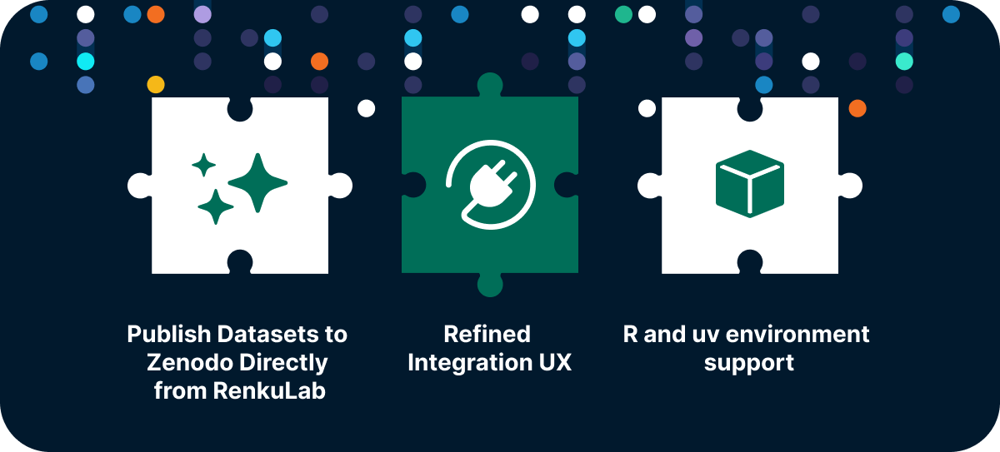
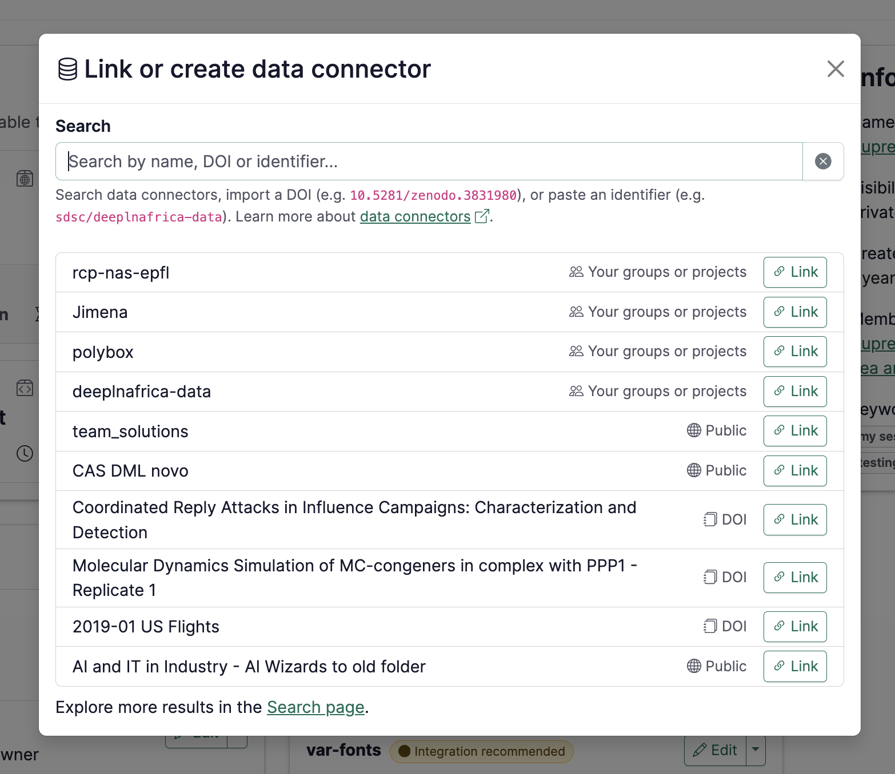
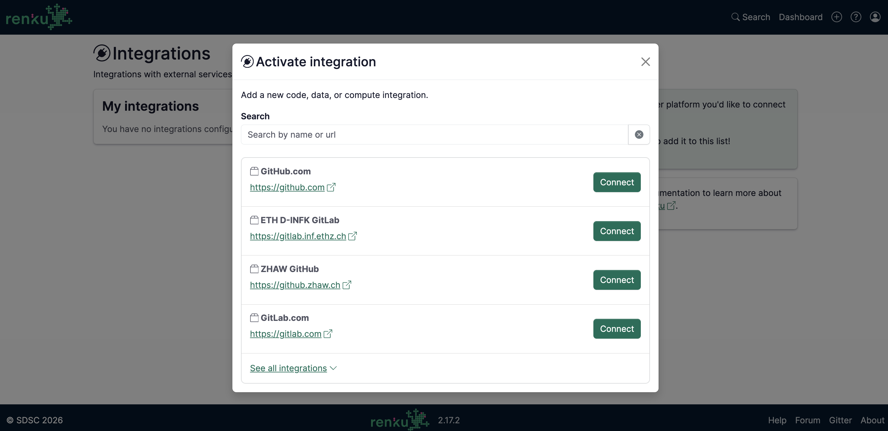

Your data might live on Zenodo, your code on GitHub, and your compute in the
cloud — but they shouldn't feel worlds apart. Renku is built to bridge these
gaps, and our latest 2.16.0 and 2.17.0 updates make it much easier to work,
share, and publish without the configuration headache.

Whether you are running data-intensive computations or preparing a project for
public citation, these enhancements keep your project resources tightly connected.

{/* truncate */}

We have focused heavily on closing the loop of the research lifecycle. From launching your favorite
interactive workspaces to sharing your final, citable results with the global community, these
latest updates remove setup clutter and smooth out your daily workflows.

---

## 🌟 Publish Datasets to Zenodo Directly from RenkuLab

The transition from a finished analysis to a published dataset is now a lot more straightforward. You no longer
need to manually export files, log into external repositories, and re-upload your data just to get a permanent
digital identifier for your work.

**How it works:** You can now publish your datasets directly to **Zenodo** right from the RenkuLab interface.
With just a few clicks, you can deposit your data, trigger a publication workflow, and generate a permanent
**DOI (Digital Object Identifier)** for your research data. This ensures your outputs are instantly citable
and fully compliant with European and Swiss Open Research Data (ORD) mandates—without ever leaving your workspace.

For more details on this feature, see the [docs](https://docs.renkulab.io/en/latest/docs/users/data/guides/export-data-connector-to-zenodo).

## 📦 Smarter Integrations and Reusing Data Connectors

We gave our integration pages and user flows an upgrade to clear away
configuration steps and make managing your connected tools easier.

- **Smarter Connector Selection:** Linking cloud storage to a new workspace now
  takes just a few seconds. Selecting from your existing endpoints is highly
  intuitive, getting you from setup to coding faster.

- **Polished Integration UX:** We’ve trimmed unnecessary clicks and clarified
  configuration steps across RenkuLab integrations, keeping your focus on the
  data rather than the interface.

## 📊 Build R Environments from Code

We haven't forgotten about our R community! Our underlying buildpacks have been
updated to version 0.6.0, introducing dedicated, first-class support for **R and
RStudio session variants**.

We currently support R projects using `renv` — if your repository includes an
`renv.lock` file, Renku will automatically build an image with all your required
packages pre-installed. See the
[docs](https://docs.renkulab.io/en/latest/docs/users/sessions/guides/environments/create-environment-with-custom-packages-installed#defining-an-r-environment-with-renv)
for more details.

## ⚡ Fast Python Environments with `uv`

Python users, this one is for you. We’ve added support for the **`uv` package
manager**, which has been a frequent request from our community. Simply use the
"build from code" launcher, point it to your `uv`-enabled repository, and Renku
will handle the rest. Please [let us
know](https://github.com/SwissDataScienceCenter/renku-frontend-buildpacks/issues?q=is%3Aissue%20state%3Aopen%20label%3Auv)
if you encounter any quirks or bugs.

**A Huge Community Shoutout:** This update wouldn't be here without our
collaborators at [Idiap](https://www.idiap.ch/en/). They did the heavy lifting by contributing these
environment improvements directly to the upstream [Paketo buildpack](https://github.com/paketo-buildpacks/python/releases/tag/v2.45.0)
ecosystem, making builds faster not just for Renku users, but for the broader
open-source community. 🙌

## 🔧 Under the Hood: Fixes & Performance

Additionally, we fixed several session bugs—including resource class selection
and resource allocation tracking—to ensure that when you launch a session, it
gets the exact compute power it requested.

While these are the highlights, there were other features addressing
administrator requirements, smaller fixes, and performance tweaks in these
releases. For the curious, you can find the full technical breakdown on our
[GitHub Releases
page](https://github.com/SwissDataScienceCenter/renku/releases).

🐸 **Ready to get started?** Hop into [renkulab.io](https://renkulab.io) and get a jumpstart with our
[documentation](https://docs.renkulab.io).

💬 **We love to hear your feedback!** Share questions, ideas, and suggestions with us on our
[forum](https://renku.discourse.group/).

🚀 **Curious about what's coming next?** Check out our
[roadmap](https://renku.notion.site/Roadmap-b1342b798b0141399dc39cb12afc60c9) to see what new
features we're working on.
