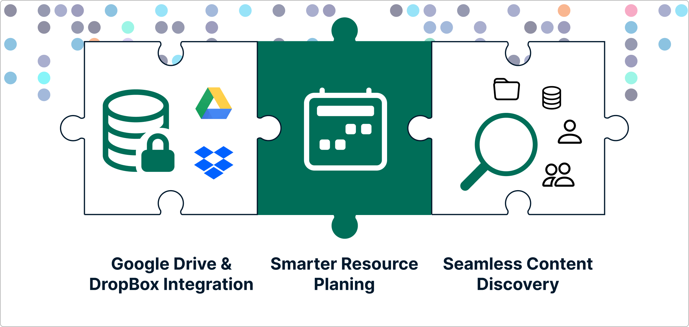

Our goal has always been to simplify the mechanics of collaborative data science.
Right through our new integrations and improved experience for reusing data connectors, releases 
**2.16.0** and **2.17.0** arrive to streamline how you work and share. Whether you
are running data-intensive computations or preparing a project for public citation, 
these latest enhancements ensure your project resources remain completely interconnected.

<!-- truncate -->

We have focused heavily on closing the loop of the research lifecycle. From launching your favorite 
interactive workspaces to sharing your final, citable results with the global community. Here is how 
the latest updates make your daily research workflows much smoother.

## 🌟 **Publish Datasets to Zenodo Directly from RenkuLab**

The transition from a finished analysis to a published dataset just got incredibly simple. You no longer 
need to manually export files, log into external repositories and re-upload your data to get a permanent 
digital identifier for your work.

**How it works:** You can now publish your datasets directly to **Zenodo** from within the RenkuLab interface. 
With just a few clicks, you can deposit your data, trigger a publication workflow, and generate a permanent 
**DOI (Digital Object Identifier)** for your research data. This ensures your outputs are instantly citable 
and compliant with European and Swiss Open Research Data (ORD) mandates without ever leaving your workspace.

## 📦 **Streamlined User Experience for Integrations and Reusing Data Connectors**

We gave our integration pages and user flows a major upgrade to make managing your connected tools entirely frictionless.

* **Effortless Connector Selection:** When adding data connectors to a project, selecting from your existing endpoints is now much more intuitive. You can link your cloud storage options to a new workspace in seconds.
* **Refined Integration UX:** The general user experience within RenkuLab integrations has been polished to minimize clicking and clarify configuration steps, keeping you focused on your code rather than your setup.

## 📊 **R and RStudio Environment Variants**

We haven't forgotten about our vibrant R community! Our underlying buildpacks have been updated to version 0.4.0, 
introducing dedicated, first-class support for **R and RStudio session variants**.

When launching a new interactive environment, you can seamlessly select pre-configured R environments that are 
completely optimized to work alongside your connected data sources. 

## **Full Release Notes**

Additionally, we fixed several session bugs, including resource class selection and CPU allocation tracking to ensure that when you launch a session, it has the exact 
compute power it requested. While these are the highlights, there were other features addressing administrator requirements, smaller fixes and 
performance tweaks in these releases. For the curious, you can find the full technical breakdown on our 
[GitHub Releases page](https://github.com/SwissDataScienceCenter/renku/releases).

---

🐸 Ready to get started? Hop into [renkulab.io](https://renkulab.io) and get a jumpstart with our
[documentation](https://docs.renkulab.io).

💬 We love to hear your feedback! Share questions, ideas, and suggestions with us on our
[forum](https://renku.discourse.group/).

🚀 Curious about what's coming next? Check out our
[roadmap](https://renku.notion.site/Roadmap-b1342b798b0141399dc39cb12afc60c9) to see what new
features we're working on.
