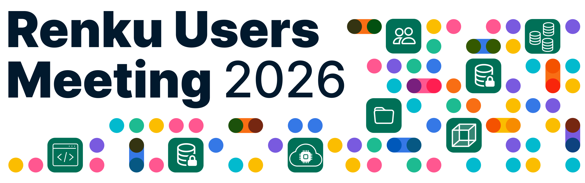

Join the 4th Renku Users Meeting to learn more about Renku, discover how others leverage it for collaborative research, and explore how to build smooth workflows for teaching and events.

We will share the features prioritized for the second half of 2026. We are also excited to host an open forum where you can voice your opinions, share challenges regarding collaborative open research, and discuss the evolving landscape of AI-driven data science.

**When**: July 2nd from 13:00 CET until 17:00 CET

**Where**: [ETH Rat Bern, Room H403, 4th Floor](https://maps.app.goo.gl/sMBQPSbnctSweYmq8) and Zoom

[**Register here to get your link to the event.**](https://renku.notion.site/3360df2efafc806e8f61dd5fc52cd738?pvs=105)

## Agenda

- **13:00-13:15** Welcome and Introduction
- **13:15-14:00** Renku Update: Milestones, Demo & Roadmap
- **14:00-14:15** Break
- **14:15-15:30** Renku Lightning Talks: Presentations with Challenges and Solutions in Teaching and Collaborative Open Research projects
- **15:30-16:30** Open Discussion: What does collaborative agentic Data Science look like in the era of AI?
- **16:30-17:00** Networking and Refreshments
