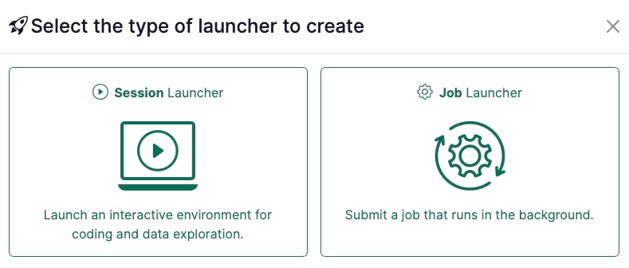
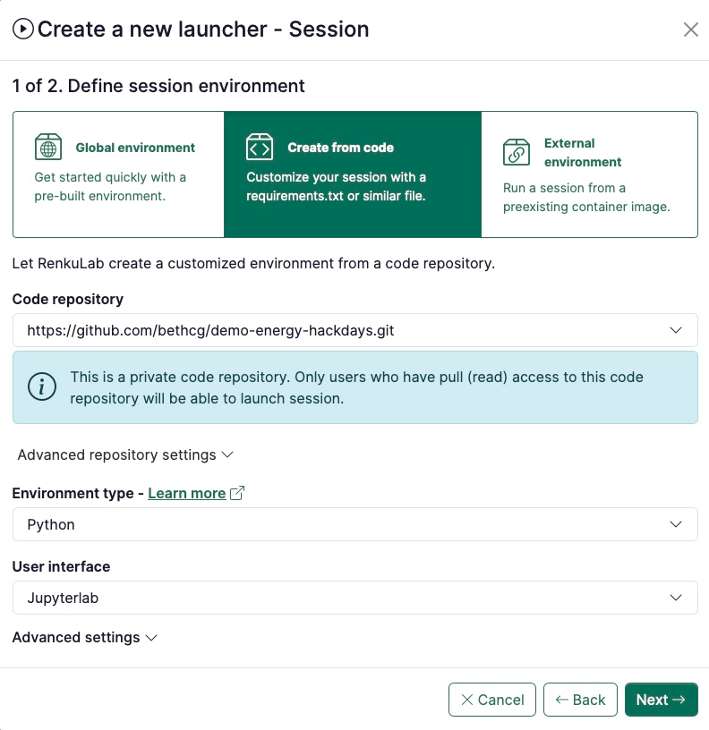
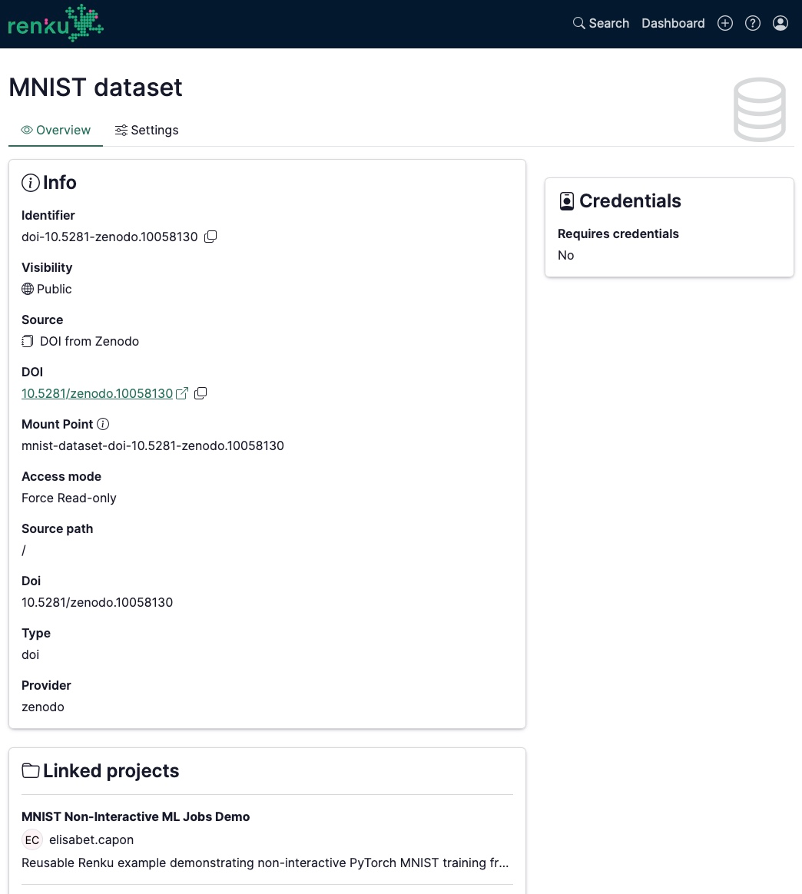

This release is about extending Renku beyond the interactive session. Your
environment, your data, and your code stay in one place, whether you are running
a long batch job, building a session from a private repository, or managing the
data connectors your projects depend on.

{/* truncate */}

Interactive sessions are where a lot of research starts, but not where it ends.
With the 2.18.0 and 2.19.0 updates, you can now take the same project you are
working in and run it as a non-interactive **job** without duplicating your
setup or shipping your work off to another platform.

---

## 🚀 Run Non-Interactive Jobs, Right from the UI

Not everything is interactive. Long training runs, large processing tasks, and
scheduled pipelines are batch work.

Renku Jobs offer a frictionless jump from exploration to execution. You can now
create a **Job launcher** right next to your Session launchers, in two ways:

- **From your existing code:** Take a project you've already been working in and
  run it as a job. Choose "build from code," point to the same repository that
  defines your interactive environment, and add one extra field, namely your job
  command. Same environment, same data, no re-setup.
- **From an external image:** Already have a Docker image you run elsewhere?
  Bring it to Renku as an external environment, set your command and arguments,
  and run it on Renku compute, even if it has no interactive front end.
  **How it works:** A Job launcher has a **Submit** button instead of Launch. When
  you submit, a modal lets you review the job command and resource class, and tweak
  them for that run only, before it goes. The job then appears on your project
  page, where you can **view logs**, **cancel** it, and track its **runtime**.
  Unlike sessions, a single Job launcher can run many jobs at once.

One project can now hold work at different stages and for different
collaborators. An ML engineer can run model-training jobs while a domain expert
tests the resulting model in a notebook or dashboard, while all data and code stay in the
same place.

{/* TODO: link to docs once published */}

## 🔒 Building Private Images from Code

The build-from-code experience introduced in earlier releases is now rounded out
to support building session launchers from **private code repositories**. Images
built from your repository can be kept private, so proprietary code and
dependencies stay contained within your project rather than being exposed.

Be aware that only collaborators with read access to your private code
repository will be able to launch a session from it.

## 🔗 Dedicated Pages for Data Connectors

Projects aren't the only things with their own page anymore: now every **data
connector** has a dedicated page too. From it, you can modify the connector's
settings, explore its metadata, and see exactly which projects the connector is
used in.

To access the data connector page, click on top of the data connector. On the right
hand side modal at the top next to the close icon, click on the **Open full page** icon.

## 🔧 Under the Hood: Fixes & Performance

Alongside these features, we shipped a range of smaller fixes, administrator
improvements, and performance tweaks across these releases. For the full
technical breakdown, see our [GitHub Releases
page](https://github.com/SwissDataScienceCenter/renku/releases).

🐸 **Ready to get started?** Hop into [renkulab.io](https://renkulab.io) and get
a jumpstart with our [documentation](https://docs.renkulab.io).

💬 **We love to hear your feedback!** Share questions, ideas, and suggestions with
us on our [forum](https://renku.discourse.group/).

📺 **Prefer a walkthrough?** Watch the Renku feature preview on
[YouTube](https://youtu.be/JX_gU1LbxKY).

🚀 **Curious about what's coming next?** Check out our
[roadmap](https://renku.notion.site/Roadmap-b1342b798b0141399dc39cb12afc60c9) to
see what new features we're working on.
