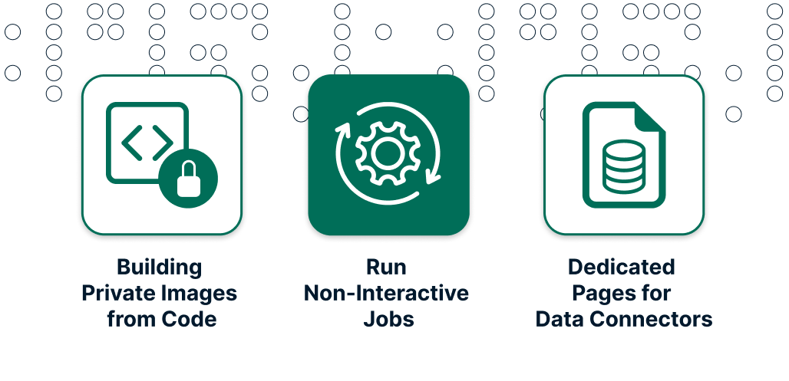
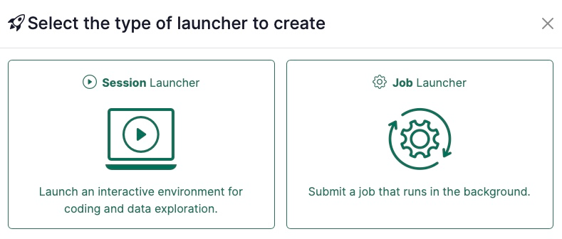
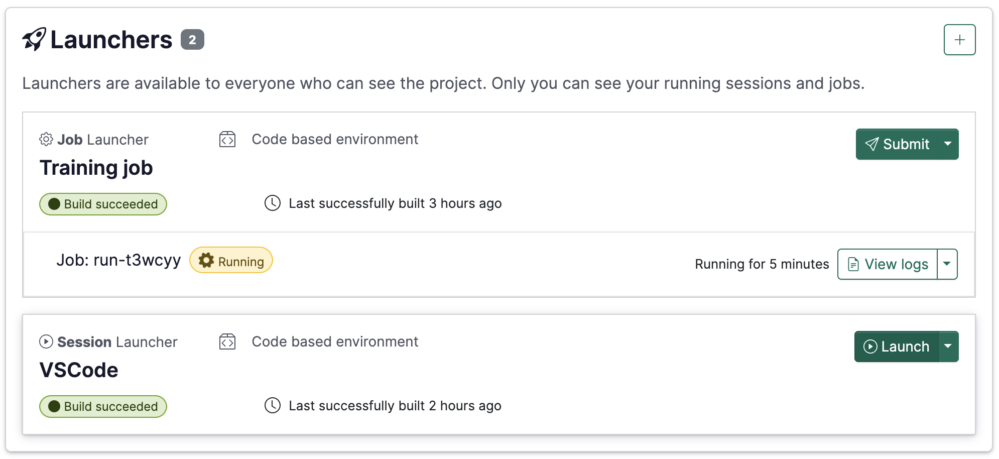
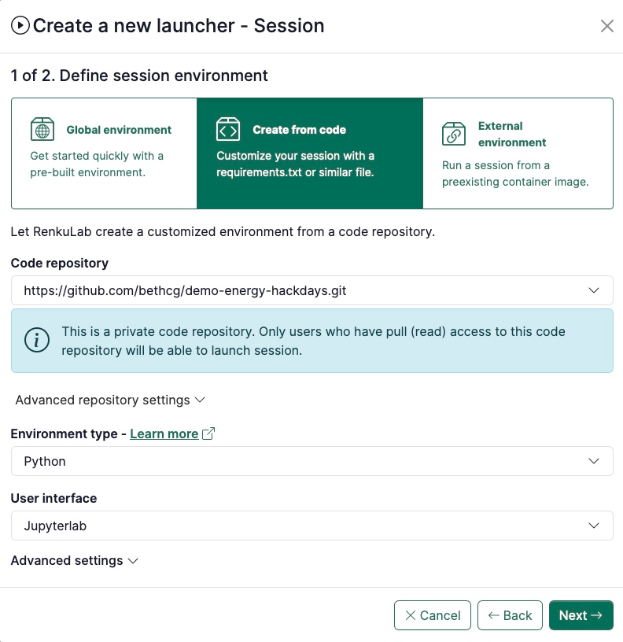
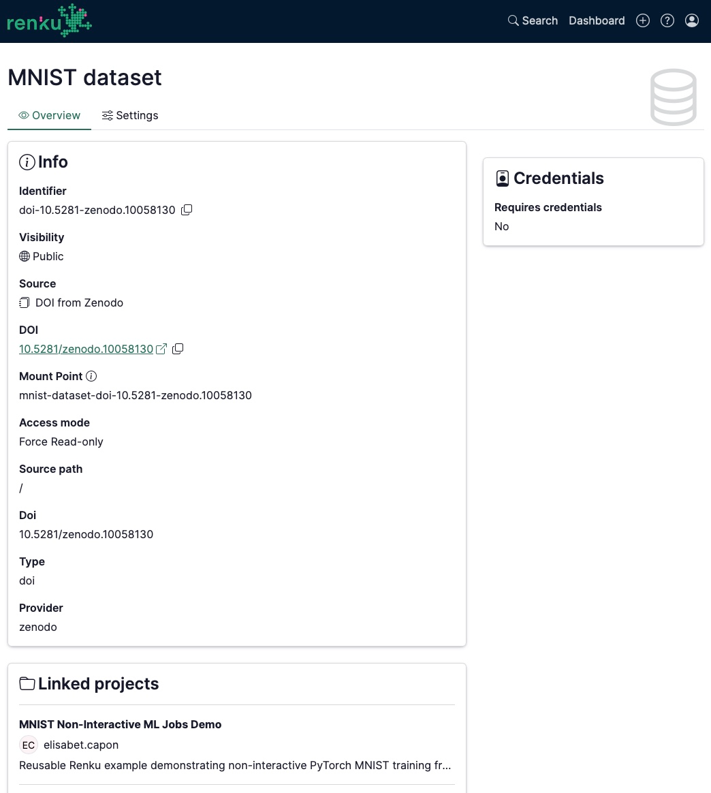

This release extends Renku beyond interactive sessions. You can now submit a job
that runs the same code, in the same environment, against the same data —
without holding a browser tab open. Also in these releases: custom environments from private
code repositories, coding agents in your sessions and dedicated pages for data connectors.

{/* truncate */}

Renku's data connectors and code repository integrations make it quick to run an
exploratory analysis, but as a project matures and tasks run longer, the
interactive session becomes the constraint. As a result, you move the project to
your laptop or a cluster, or fall back on tricks to keep the session alive. Renku
Jobs, in release 2.19.0, removes that constraint.

---

## 🚀 Run Non-Interactive Jobs

A single Renku project can now carry work from first exploration through to long
training runs. An ML engineer can run model-training jobs while a domain expert
tests the resulting model in a notebook or dashboard, with all data and code
staying in the same place.

You can create a **Job launcher** right next to your Session launchers, in
two ways:

- **From your existing code:** Take a project you've already been working in and
  run it as a job. Choose "build from code," point to the same repository that
  defines your interactive environment, and specify one extra field: the command
  to run.

- **From an external image:** Already have a Docker image you run elsewhere?
  Bring it to Renku as an external environment, set your command and arguments,
  and run it on Renku compute, even if it has no interactive front end.

**How it works:** A Job launcher has a **Submit** button instead of Launch. When
you submit, a modal lets you review the job command and resource class, and
tweak them for that run only, before it goes. The job then appears on your
project page, where you can **view logs**, **cancel** it, and track its
**runtime**. Unlike sessions, a single Job launcher can run many jobs at once
within your resource pool's limits.

For more details on the new Jobs feature, have a look at the
[documentation](https://docs.renkulab.io/en/latest/docs/users/compute/job/).

## 🔒 Custom Environment from Private Code Repositories

Starting from release 2.18.0 you can build images for sessions and jobs from
private code repositories, not just public ones. You no longer need to create
ad-hoc public repositories just to build an image. Images built from your
repository are kept private too, so proprietary code and dependencies stay
contained within your project rather than being exposed.

:::note

Be aware that only collaborators with read access to your private code
repository will be able to launch a session or start a job from it.

:::

## 🤖 Using Coding Agents in Renku

A Renku session is a clean, isolated environment - exactly where a coding agent
works best, with your credentials and data kept contained. You can now bring an
agent into your session by building the environment from code: add a
`project.toml` file to the repository you build your image from, and Renku sets
the agent up for you. We currently support **Claude, Codex, and Pi**.

Renku also picks up your agent-specific configuration. If your repository
includes a config folder for your agent (`.claude`, `.pi`, or `.codex`), Renku
brings it into your session, so your custom skills and plugins come along
automatically.

Want to see it in action? Explore the [coding agents example
project](https://renkulab.io/p/sdsc/coding-agents-example-full) for a working
setup you can copy from.

## 🔗 Dedicated Pages for Data Connectors

Projects aren't the only things with their own page anymore: now every **data
connector** has a dedicated page too. From it, you can modify the connector's
settings, explore its metadata, and see exactly which projects the connector is
used in.

To access the data connector page, click a data connector to open its side-panel,
then click the "Open full page" icon in the top right.

## 🔧 Under the Hood: Fixes & Performance

Alongside these features, we shipped a range of smaller fixes, administrator
improvements, and performance tweaks across these releases. For the full
technical breakdown, see our [GitHub Releases
page](https://github.com/SwissDataScienceCenter/renku/releases).

🐸 **Ready to get started?** Hop into [renkulab.io](https://renkulab.io) and get
a jumpstart with our [documentation](https://docs.renkulab.io).

💬 **We love to hear your feedback!** Share questions, ideas, and suggestions with
us on our [forum](https://renku.discourse.group/).

📺 **Prefer a walkthrough?** Watch the Renku feature preview on
[YouTube](https://youtu.be/JX_gU1LbxKY).

🚀 **Curious about what's coming next?** Check out our
[roadmap](https://renku.notion.site/Roadmap-b1342b798b0141399dc39cb12afc60c9) to
see what new features we're working on.
