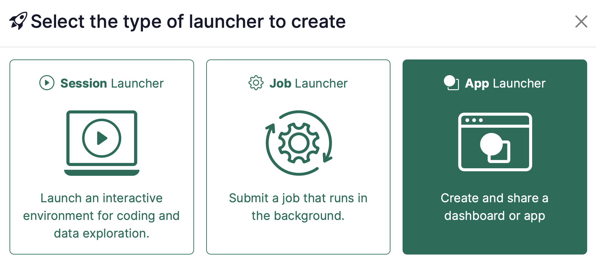
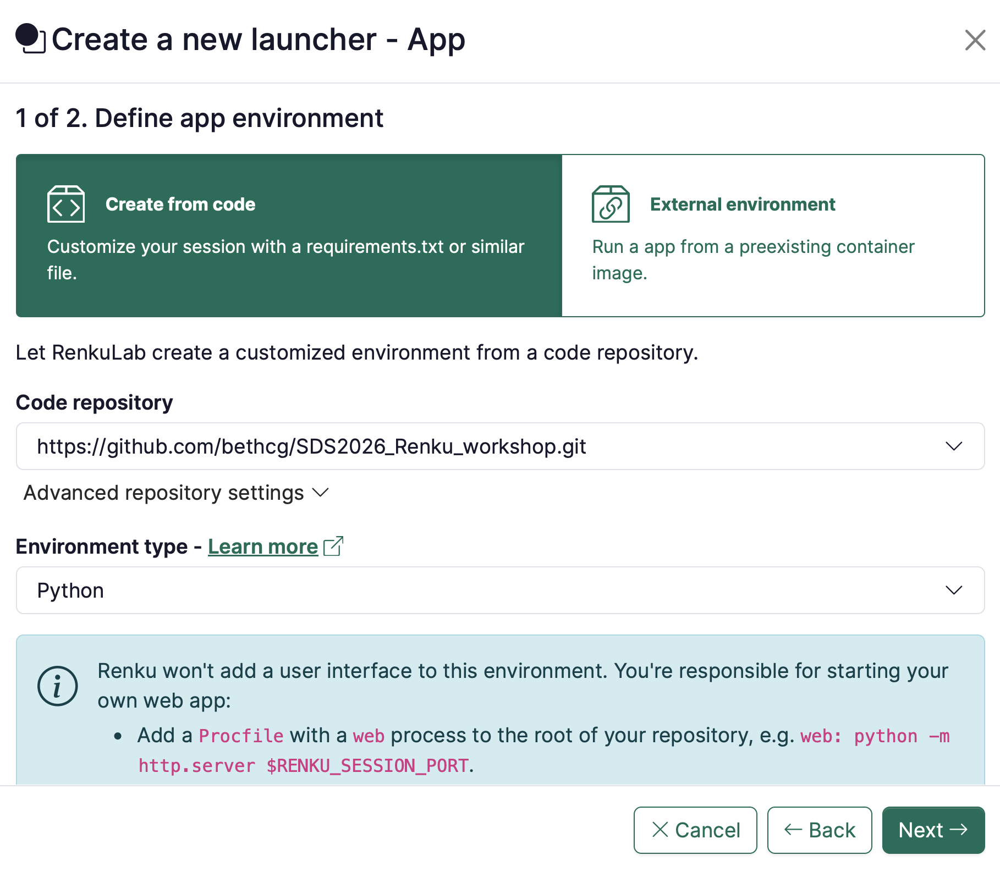

Renku has always made it easy to build your project and share it with a collaborator through a simple link.
This release takes that a big step further. With Renku Apps, you can now publish your work as a live, always-ready
app that opens when someone clicks. Starting with this release, we also offer Renku project storage:
any project can get its own fast, persistent home for its data.

{/* truncate */}

## 🚀 Publish your project as an App

Renku has always been a great place to build a dashboard, a demo or an interactive report.
But sharing one used to mean asking your collaborator to access the project, to launch a session
and to wait for it to spin up first. For interactive sessions, where you do the work, namely
writing and running code in RStudio, Jupyter or VS Code, it's fine that they take some time to launch.
When you simply want someone to view and interact with the result, though, sending them into a
session to start it up first is a poor experience.

With **Apps**, you can now publish your project as a live app that's ready the moment
someone opens the link. Dashboards built with Streamlit or Shiny, interactive demos,
and model endpoints you can send requests to, all served directly from your project.

To create a Renku App, first define your dashboard or app in a git repository. Include a
[one-line configuration file](https://github.com/bethcg/SDS2026_Renku_workshop/blob/main/Procfile)
to your repo that tells Renku how to run your app. Then, attach your code repository to a Renku project,
create an app launcher that connected to the code repository, and you're done!

Renku deploys it behind a stable URL based on your project and launcher names. Anyone with the
link goes straight to the app: no Renku project to open, no session to wait for, no setup on their end.
When traffic picks up, your app scales to meet demand; when no one's using
it, it scales back down to zero, so we avoid idle compute. As apps run from the same
project as everything else, they can pull in your data through data connectors, just like
your sessions do.

For this first release, apps run on **public projects**. If you make a project with a
live app private, the app is switched off.

Learn more about Renku Apps in our [documentation](https://docs.renkulab.io/en/latest/docs/users/compute/app/).
Check [our demo project on energy demand of the buildings](https://renkulab.io/p/renku-team/energy-consumption-monitoring).

## 💾 Give your project its own persistent storage

Until now, Renku connected your compute to your storage, but didn't offer storage of
its own. In those cases where _fast_ data access is required, the advice was to copy data
into the session workspace by hand and re-copy it every time the session shut down. It worked,
but it was a hassle, and it wasn't obvious.

**Project storage** resolves that gap and gives you a place to put your data without needing to create a data connector to an external data source. Plus, since this storage lives inside RenkuLab itself, it's fast, so there's no need to copy data into the session workspace for best performance.

To make sure we get this feature right, we are rolling out this feature with limited access as a start. If you'd like to use project storage, simply get in touch at hello@renku.io and let us know the Renku project where you'd like to add storage.
After activating Project storage, anyone in the project will be able to attach the storage
from the [Data section](https://docs.renkulab.io/en/latest/docs/users/data/project-storage).
Once created, it's available in every session and
job launched from that project, and it's shared automatically with everyone working on the
project. Multiple sessions can read and write to it at the same time, and your data stays
put when a session pauses, resumes or shuts down. Access follows your existing project roles:
owners and editors can read and write, viewers get read-only access and anonymous
users have no access even on a public project.

The result is data that's fast, persistent, and right next to your compute, without
anyone having to think about where it lives.

## 🌟 Expanding Data Repository Integrations: Connectors for PSI's SciCat and Publishing to WSL's EnviDat

We continue working to support more data sources and more publishing destinations:

- **Import from PSI SciCat.** You can now import datasets directly from the
  [PSI SciCat](https://discovery.psi.ch/) data catalog, alongside the existing import
  sources.
- **Export to EnviDat.** Data can now be exported from Renku to the
  [EnviDat](https://envidat.ch/) platform.

## 🔧 Under the Hood: Fixes & Performance

This release also includes a wide range of smaller fixes and improvements across the
platform such as persisted logs and compute resources within groups.
As usual, the full list lives in our [GitHub Releases
page](https://github.com/SwissDataScienceCenter/renku/releases).

🐸 **Ready to get started?** Hop into [renkulab.io](https://renkulab.io) and get
a jumpstart with our [documentation](https://docs.renkulab.io).

💬 **We love to hear your feedback!** Share questions, ideas, and suggestions with
us on our [forum](https://renku.discourse.group/).

📺 **Prefer a walkthrough?** Watch the Renku feature preview on
[YouTube](https://youtu.be/YbIElMZB-Pw?si=myu3wRpH1uWruwbK).

🚀 **Curious about what's coming next?** Check out our
[roadmap](https://renku.notion.site/Roadmap-b1342b798b0141399dc39cb12afc60c9) to
see what new features we're working on.
