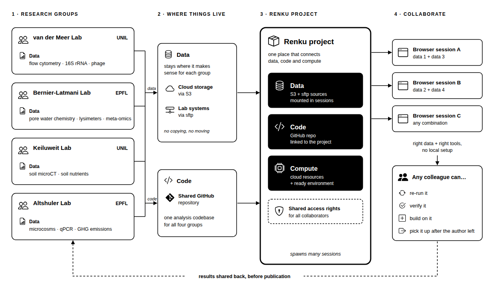

Five research groups in the [NCCR Microbiomes](https://nccr-microbiomes.ch) are collaborating on long-term study. One of the student researchers generates data, performs analyses, and then graduates - as students do - and the project goes on. Months after her departure, a collaborator from a different research group has a question about one of the figures she generated: at which taxonomic level did she perform that ordination?
A couple of years ago, he would have sent an e-mail and hoped that, despite the fact that she's been busy transitioning to a new role, she could recall or quickly find the answer. Luckily, however, he has a simpler alternative: opening their [Renku](https://renkulab.io) project and retracing the creation of her figure. He sees the data as she left them, the steps of her analysis, and which variables she plotted. He can also easily re-run the ordination at a different taxonomic level, just to see how it compares.

This level of reproducibility is possible because the NCCR Microbiomes teamed up with the SDSC to support their active-phase research projects. Specifically, they expanded the reach of the Renku platform, to connect to data on institutional servers. This is a key feature for researchers who are required to store research data on these servers, but wish to collaborate across institutions sharing data, code and compute resources. In this post we describe a specific example of how the approach pays off.

{/* truncate */}

## The NCCR Microbiomes challenge

As a National Centre of Competence in Research, the NCCR Microbiomes aims to
enable and enhance collaborations among its member groups. That ambition runs into a practical problem: collaboration only works if data and code can move easily between groups, and,
crucially, _before_ results are published.

Pre-publication sharing is exactly where institutional policies and mismatched
setups tend to get in the way.

## Multi-party data, code and compute with Renku

The NCCR Flagship projects encourage collaboration among multiple groups, which distribute data generation and analysis across groups and institutions. This particular Flagship project includes:

- The [**Environmental Microbiology Laboratory, Bernier-Latmani Lab - EPFL**](https://www.epfl.ch/labs/eml/), which runs the long-term lysimeter study. Samples are collected at discrete time points; the collaborating groups perform different analyses on these samples. The EML performs metagenomic and metatransciptomic analyses, as well as recording the sample metadata.
- The [**Environmental and Evolutionary Microbiology, van der Meer Lab - UNIL**](https://www.unil.ch/fbm/en/home/menuinst/recherche/ssf/dmf/recherche/van-der-meer.html), which generates flow cytometry data, 16S rRNA gene amplicon data, and phage data from the EML's lysimeter samples.
- The [**Molecular Biogeochemistry of Soils, Keiluweit Lab - UNIL**](https://wp.unil.ch/bgc/), which generates soil structure microCT data, and measures soil nutrient parameters from the EML's lysimeter samples.
- The [**Microbiome Adaptation to the Changing Environment, Altshuler Lab - EPFL**](https://www.epfl.ch/labs/mace/research/), which runs a parallel soil microcosm study that informs the lysimeter sampling schedule. 

These various data sets live on the institutional servers, reached over **sftp**, or in **S3** cloud storage that syncs with the server. Collaborators are granted access permissions to the other groups' folders. The analysis code sits in a shared **GitHub repository**. A private Renku project connects data and code, and adds cloud compute, so a single project can spawn many browser-based sessions that combine different data sources with the right tools. Collaborators do not need to install software or rebuild a computational environment before looking at a result; rather, they create a shared project and launch interactive sessions directly in the browser.

## Reproducibility for the NCCR and beyond

This is the day-to-day practice of reproducibility that enables and reinforces a
collaboration: not just "can the original author re-run it," but "can a colleague
pick it up, verify it, and build on it." And moreover, not just a colleague who works down the hall, but one removed in space or time. Keeping data, code and compute in one place turns pre-publication sharing from a special effort into the modus operandi. A single figure, re-opened and re-examined
long after its author left, is a small but honest proof that the model works.

For collaborations whose value depends on data and code flowing freely between
groups, Renku brings data, code and compute together so that results remain in play over the active phase of research. In the spirit of Open Science, that is exactly the kind of shared ground the NCCR Microbiomes set out to build.

---

_Want to see how Renku can help your project share data and code across groups?
[Explore RenkuLab](https://renkulab.io) or [contact our
team](https://docs.renkulab.io/en/latest/docs/users/community) to
discuss your use case._
