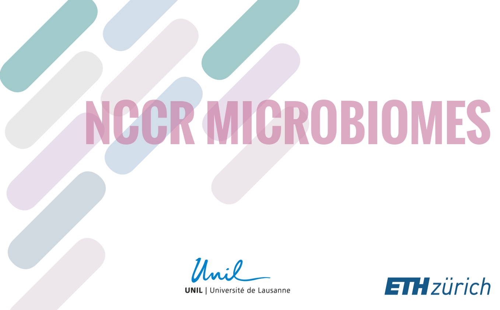

A researcher leaves the project. Months later, a question comes up about one of
their figures, e.g. which taxonomic level was that ordination actually computed at?
Usually that question just goes unanswered. In the [NCCR
Microbiomes](https://nccr-microbiomes.ch) it will not, because the
data, the code and the computing environment will still live together in one
[Renku](https://renkulab.io) project.

The NCCR Microbiomes teamed up with the SDSC to use the Renku platform to unite
data, code and compute across research groups. In this post
we describe how and walk through one specific example where it pays off.

{/* truncate */}

## The NCCR Microbiomes challenge

As a National Centre of Competence in Research, the NCCR Microbiomes exists to
enable and enhance collaborations, and to add value beyond what its research
groups could achieve on their own. That ambition runs into a practical problem:
collaboration only works if data and code can move easily between groups, and,
crucially, _before_ results are published.

Pre-publication sharing is exactly where institutional policies and mismatched
setups tend to get in the way.

## Uniting data, code and compute with Renku

The NCCR WP3 Flagship groups distributed across different institutions generate
strikingly different kinds of data:

- [**Environmental and Evolutionary Microbiology, van der Meer Lab - UNIL:**](https://www.unil.ch/fbm/en/home/menuinst/recherche/ssf/dmf/recherche/van-der-meer.html) flow cytometry data, 16S rRNA gene amplicon data, phage data
- [**Environmental Microbiology Laboratory, Bernier-Latmani Lab - EPFL**:](https://www.epfl.ch/labs/eml/) pore water chemistry, lysimeter sample metadata,
  meta-genome and meta-transcriptome data
- [**Molecular Biogeochemistry of Soils, Keiluweit Lab - UNIL:**](https://wp.unil.ch/bgc/) soil structure microCT data, soil nutrient parameters
- [**Microbiome Adaptation to the Changing Environment, Altshuler Lab - EPFL:**](https://www.epfl.ch/labs/mace/research/) microcosm data, qPCR data, greenhouse-gas emission measurements

Those data live where it makes sense for each group, in cloud storage and on
lab systems, reached over **S3** and **sftp**, while the analysis code sits in a
shared **GitHub repository**. A Renku project connects data and code, and
adds cloud compute, so a single project can spawn many browser-based sessions
that combine different data sources with the right tools. Instead of each
collaborator rebuilding a computational environment before they can even look at
a result, they create a shared project, get access rights and launch interactive
sessions directly in the browser.

## Reproducibility for the NCCR and beyond

This is the everyday version of reproducibility that actually matters to a
collaboration: not just "can the original author re-run it," but "can a colleague
pick it up, verify it, and build on it", including after that author has moved
on. Keeping data, code and compute in one place turns pre-publication sharing
from a special effort into the default. A single figure, reopened and extended
long after its author left, is a small but honest proof that the model works.

## Summary

For collaborations whose value depends on data and code flowing freely between
groups, often before anything is published, Renku brings data, code and compute
together so that results stay reproducible and can be handed over, not just
archived. In the wake of open science, that is exactly the kind of
shared ground the NCCR Microbiomes set out to build.

---

_Want to see how Renku can help your project share data and code across groups?
[Explore RenkuLab](https://renkulab.io) or [contact our
team](https://docs.renkulab.io/en/latest/docs/users/community) to
discuss your use case._
